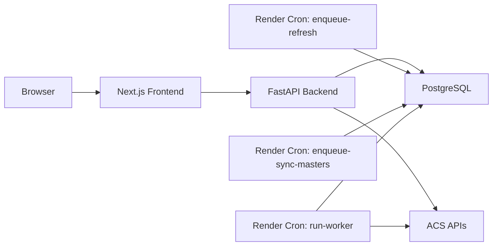

# Fraud Checker v2

Render + PostgreSQL 前提で運用する、不正監視用のモノリスです。  
ACS API からクリック / コンバージョン / マスタを取り込み、疑わしい IP / User-Agent 単位の findings を永続化し、Next.js の監視 UI から参照します。

このリポジトリの方針は次の通りです。

- モノリスを維持する
- PostgreSQL を analytics と coordination の単一基盤として使う
- request-time compute を避け、重い処理は durable job に寄せる
- frontend は read-oriented monitoring UI として保つ
- Render 上では enqueue-only + queue runner で運用する

## 目次
- [システム概要](#システム概要)
- [機能](#機能)
- [アーキテクチャ](#アーキテクチャ)
- [同期と処理の流れ](#同期と処理の流れ)
- [ディレクトリ構成](#ディレクトリ構成)
- [必要環境](#必要環境)
- [環境変数](#環境変数)
- [ローカル開発](#ローカル開発)
- [CLI と運用コマンド](#cli-と運用コマンド)
- [API と権限モデル](#api-と権限モデル)
- [Render 本番運用](#render-本番運用)
- [データ保持と証跡](#データ保持と証跡)
- [テスト](#テスト)
- [トラブルシュート](#トラブルシュート)
- [関連ドキュメント](#関連ドキュメント)

## システム概要

このシステムは、affiliate traffic の fraud monitoring を目的とした専用システムです。  
BI 基盤でも汎用 ETL 基盤でもなく、次の監視業務に特化しています。

- 日次の click / conversion 監視
- persisted conversion findings の抽出
- dashboard / alerts / alert detail での triage
- freshness / quality の可視化
- 管理者による手動同期

frontend は監視画面です。  
write-side の中核ロジックは backend と PostgreSQL に寄せています。

## 機能

### 監視
- ダッシュボード
  - 全体フラウド率
  - 未対応アラート件数
  - 被害推定額
  - アフィリエイター別ランキング
- アラート一覧
  - status/date filter
  - pagination
  - grouped triage
  - bulk review
- アラート詳細
  - reason drill-down
  - recent transactions
  - review action

### 取り込み
- ACS click log 取り込み
- ACS conversion log 取り込み
- ACS master data 同期

### 判定
- click / conversion の suspicious findings を Python detector で計算
- request-time ではなく persisted findings として保存
- affected date 単位で再計算

### 運用
- durable `job_runs`
- lease-based worker
- stale job recovery
- retry / dedupe / queue metrics
- retention first pass

## アーキテクチャ

### 技術スタック

#### Backend
- Python 3.12
- FastAPI
- SQLAlchemy
- Alembic
- psycopg / PostgreSQL

#### Frontend
- Next.js 16
- React 19
- TypeScript
- Tailwind 4

#### Infra
- Render
- PostgreSQL
- Cron-driven queue runner
- Timezone: `Asia/Tokyo`

### 高レベル構成



### 重要な設計判断

- heavy write flow は API request 内で完結させない
- production の write path は enqueue-only
- queue coordination は PostgreSQL だけで完結させる
- frontend は read path を中心にし、admin action も compact に保つ
- dashboard / alerts は monitoring read model として保つ

## 同期と処理の流れ

### 1. 定期ジョブが enqueue する

Render cron が同期要求を durable queue に積みます。

- 毎時 `0分`
  - `enqueue-refresh --hours 1 --detect`
- 毎日 `03:30`
  - `enqueue-sync-masters`
- 毎分
  - `run-worker --max-jobs 5`

### 2. worker が queue を実行する

worker は `job_runs` から queued job を拾って実行します。

- lease-based locking
- stale recovery
- retry / backoff
- dedupe

### 3. raw data を保存する

ACS API から取得した click / conversion を PostgreSQL に保存します。

### 4. findings を再計算して保存する

取り込みや設定更新の結果、影響した date だけを再計算します。  
計算結果は persisted findings tables に保存されます。

### 5. API が persisted data を返す

dashboard / alerts / alert detail は request-time detector を回さず、persisted findings / aggregates を読みます。

### 6. frontend が UI 表示する

frontend は backend の payload を UI domain state に変換して表示します。  
alerts は URL search params と同期し、detail は lazy fetch で transaction evidence を開きます。

## ディレクトリ構成

```text
.
├─ backend/      FastAPI, CLI, detector, repository, migrations, tests
├─ frontend/     Next.js App Router, monitoring UI, proxy routes, unit tests
├─ docs/         architecture packs, phase docs, design system
├─ render.yaml   Render deployment and cron definition
└─ dev.py        backend + frontend 同時起動用のローカル runner
```

### backend 主要領域

- `backend/src/fraud_checker/api.py`
  - FastAPI entrypoint
- `backend/src/fraud_checker/api_routers/`
  - health / jobs / masters / reporting / settings / suspicious / testdata
- `backend/src/fraud_checker/services/`
  - jobs / findings / reporting / settings / lifecycle / e2e_seed
- `backend/src/fraud_checker/repositories/`
  - ingestion / reporting_read / suspicious_read / master / settings
- `backend/src/fraud_checker/job_status_pg.py`
  - durable job store
- `backend/alembic/versions/`
  - migrations

### frontend 主要領域

- `frontend/src/app/`
  - App Router routes
- `frontend/src/app/api/console/`
  - backend proxy routes
- `frontend/src/components/`
  - monitoring UI components
- `frontend/src/lib/console-api.ts`
  - console API anti-corruption layer
- `frontend/src/features/`
  - dashboard / alerts / alert detail screens

## 必要環境

### ローカル実行
- Python `3.12.x`
- Node.js `22.20.0`
- PostgreSQL

### 推奨
- Windows / macOS / Linux どれでも動作可能
- 文字コードは UTF-8 / LF 固定

## 環境変数

### 必須

#### backend
- `DATABASE_URL`
  - PostgreSQL 接続文字列
- `ACS_BASE_URL`
- `ACS_ACCESS_KEY` / `ACS_SECRET_KEY`
  - もしくは `ACS_TOKEN`

#### frontend
- `NEXT_PUBLIC_API_URL`
  - frontend から backend へ向く URL
- `FC_READ_API_KEY`
  - frontend server proxy が read API を呼ぶための key

### 権限・認証

- `FC_ADMIN_API_KEY`
  - backend admin endpoint 用
- `FC_READ_API_KEY`
  - read auth を有効にする場合の analyst key

### runtime posture

- `FC_ENV`
  - `dev`, `test`, `production` など
- `FC_REQUIRE_READ_AUTH=true`
  - read API に認証を要求
- `FC_EXTERNAL_READ_PROTECTION=true`
  - 外側保護前提
- `FC_ALLOW_PUBLIC_READ=true`
  - public minimal read を許可

production では上の 3 つの read posture のどれか 1 つを明示する必要があります。

### production で禁止される危険フラグ

- `FC_ALLOW_INSECURE_ADMIN=true`
- `ACS_ALLOW_INSECURE=true`

production でこれらが有効だと app startup が hard-fail します。

### frontend admin action 用

dashboard から `更新` を使う場合、frontend server process でも次を設定してください。

- `FC_ADMIN_API_KEY`

重要:
- `NEXT_PUBLIC_` ではありません
- ブラウザへ露出させず、Next.js route handler から backend admin API へ proxy します
- 未設定なら admin action strip は非表示になります

### ローカルでよく使う例

```bash
DATABASE_URL=postgresql+psycopg://postgres@localhost:5432/fraudchecker
NEXT_PUBLIC_API_URL=http://localhost:8001
FC_ENV=dev
FC_READ_API_KEY=dev-read-secret
FC_ADMIN_API_KEY=dev-admin-secret
```

## ローカル開発

### 1. backend 依存を入れる

```bash
cd backend
python -m pip install -e ".[dev]"
```

### 2. frontend 依存を入れる

```bash
cd frontend
npm ci
```

### 3. DB migration を適用する

```bash
cd backend
alembic upgrade head
```

### 4. 起動する

リポジトリルートから:

```bash
python dev.py
```

起動先:
- backend: [http://localhost:8001](http://localhost:8001)
- frontend: [http://localhost:3000](http://localhost:3000)

### 個別起動

#### backend

```bash
cd backend
python -m uvicorn fraud_checker.api:app --reload --app-dir ./src --port 8001
```

#### frontend

```bash
cd frontend
npm run dev -- --hostname 0.0.0.0 --port 3000
```

## CLI と運用コマンド

### 通常運用用

#### refresh を queue に積む

```bash
cd backend
python -m fraud_checker.cli enqueue-refresh --hours 1 --detect
```

#### master sync を queue に積む

```bash
cd backend
python -m fraud_checker.cli enqueue-sync-masters
```

#### queue worker を回す

```bash
cd backend
python -m fraud_checker.cli run-worker --max-jobs 5
```

### break-glass 用 inline 実行

通常運用では非推奨です。  
緊急時の切り分けやローカル検証用です。

```bash
cd backend
python -m fraud_checker.cli refresh --hours 12 --detect
python -m fraud_checker.cli sync-masters
```

### retention / purge

既定は dry-run です。

```bash
cd backend
python -m fraud_checker.cli purge-data
python -m fraud_checker.cli purge-data --execute
```

## API と権限モデル

### public / analyst / admin の概念

このシステムの read endpoint はすべて同じ機密度ではありません。  
運用上は少なくとも次の 3 階層で考えます。

- public minimal
- analyst-auth
- admin-only

### 主な read endpoint

#### analyst-auth
- `GET /api/console/dashboard`
- `GET /api/console/alerts`
- `GET /api/console/alerts/{finding_key}`
- `GET /api/masters/status`
- `GET /api/job/status`

#### admin-only
- `GET /api/job/status/admin`
- `GET /api/settings`
- `POST /api/settings`
- `POST /api/refresh`
- `POST /api/sync/masters`
- `POST /api/ingest/*`
- `GET /api/health`

#### public minimal
- `GET /`
- `GET /api/health/public`

### console list / detail の扱い

- alerts list:
  - 一覧 triage に必要な status / affiliate / damage を返す
  - 被害推定額は findings 生成時 snapshot を優先する
- alert detail:
  - summary は findings snapshot を使う
  - transaction table は raw evidence が残る範囲で recent data を返す

### frontend admin action

dashboard には admin capability がある時だけ compact action を出します。

- `更新`

## Render 本番運用

本番は `render.yaml` を正本とします。

### Web

#### backend
- `fraudchecker-backend`

#### frontend
- `fraudchecker-frontend`

### Cron

#### refresh enqueue
- `fraudchecker-refresh-hourly`
- schedule: 毎時 `0分`
- command:

```bash
python -m fraud_checker.cli enqueue-refresh --hours 1 --detect
```

#### master sync enqueue
- `fraudchecker-sync-masters-daily`
- schedule: 毎日 `03:30`
- command:

```bash
python -m fraud_checker.cli enqueue-sync-masters
```

#### queue runner
- `fraudchecker-queue-runner-minute`
- schedule: 毎分
- command:

```bash
python -m fraud_checker.cli run-worker --max-jobs 5
```

### production model

Render 本番では次を前提にしています。

- API は enqueue-only
- cron は enqueue または worker 実行
- in-process background kick は使わない

`render.yaml` では backend に次を明示しています。

```yaml
FC_ENABLE_IN_PROCESS_JOB_KICK: "false"
```

## データ保持と証跡

### findings

suspicious findings は request-time ではなく persisted です。  
lineage は少なくとも次を持ちます。

- `computed_by_job_id`
- `settings_updated_at_snapshot`
- `source_click_watermark`
- `source_conversion_watermark`
- `estimated_damage_yen`
- `damage_unit_price_source`
- `damage_evidence_json`
- `generation_id`
- `computed_at`

### retention

現状の first pass は次です。

- raw: 90日
- aggregates: 365日
- findings: 365日
- finished job runs: 30日

### evidence

- damage snapshot は findings 生成時に保存する
- transaction detail は evidence access として raw retention の影響を受ける
- retention contract により expired になる detail がある

## テスト

### backend

```bash
cd backend
pytest
```

### frontend unit / component

```bash
cd frontend
npm test
```

### frontend lint / typecheck

```bash
cd frontend
npm run lint
npm run typecheck
```

### frontend E2E

現時点では repo に Playwright smoke は未整備です。  
frontend は unit / component test を正本とし、E2E は今後の追加対象です。

## トラブルシュート

### dashboard が読み込みのまま

確認ポイント:

- backend が起動しているか
- `NEXT_PUBLIC_API_URL` が backend を向いているか
- queue runner が止まっていないか
- `last_successful_ingest_at` と `findings_last_computed_at` が stale になっていないか

### admin action が dashboard に出ない

確認ポイント:

- frontend server env に `FC_ADMIN_API_KEY` があるか
- backend 側で admin auth が通るか
- production で read posture が適切に設定されているか

### docs が production で出ない

これは想定動作です。  
production では API docs は既定で無効です。

明示的に有効化する場合だけ:

```bash
FC_ENABLE_API_DOCS=true
```

### read API posture で startup が落ちる

production では次のいずれか 1 つを必ず設定してください。

- `FC_REQUIRE_READ_AUTH=true`
- `FC_EXTERNAL_READ_PROTECTION=true`
- `FC_ALLOW_PUBLIC_READ=true`

複数同時指定は不可です。

## 関連ドキュメント

- [Business Test Scenarios](docs/business-test-scenarios.md)
- [Project Review 2026-04-07](docs/project-review-2026-04-07.md)

## 補足

この README は current architecture に追従するため、以下を前提に書いています。

- durable `job_runs`
- enqueue-only production model
- persisted findings
- damage snapshot on findings
- freshness と raw ingest freshness の分離
- URL state sync
- read proxy with `FC_READ_API_KEY`
- compact admin actions on dashboard

もしこれらの前提を変える場合は、README も同時に更新してください。
