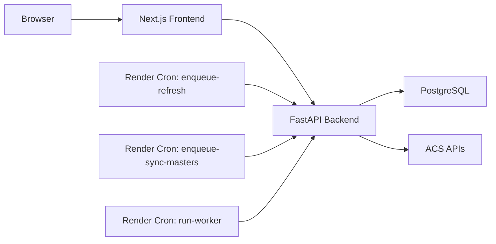

# Fraud Checker v2

Fraud Checker is a fraud monitoring console for affiliate traffic. It ingests ACS clicks, conversions, and master data into PostgreSQL, computes persisted fraud findings, and serves a triage console built with Next.js.

## Current operating model

- Backend writes are queue-driven through durable `job_runs`.
- Production refresh and master sync flows are enqueue-only.
- Findings are persisted and exposed as stable environment cases.
- Console triage is case-centric, not affiliate-centric.
- Console authorization is identity-based:
  - authenticated viewers can read, review, refresh, and master sync

## Core concepts

### Case identity

- A triage item is identified by `case_key`.
- `case_key` is derived from:
  - `"conversion_case|date|ipaddress|useragent"`
- `finding_key` is still stored, but it is an internal lineage key tied to one recompute generation and one rule version.

### Evidence model

- The primary detail table is `evidence_transactions`.
- Evidence rows always match the suspicious environment:
  - same date
  - same IP address
  - same user agent
- `affiliate_recent_transactions` is secondary context only.

### Review model

- Reviews are stored in:
  - `fraud_alert_review_events`
  - `fraud_alert_review_states`
- Review mutations require:
  - `case_keys`
  - `status`
  - `reason`
- Review responses return:
  - `requested_count`
  - `matched_current_count`
  - `updated_count`
  - `missing_keys`
  - `status`

## Architecture

### Backend

- Python 3.12
- FastAPI
- SQLAlchemy
- Alembic
- PostgreSQL

### Frontend

- Next.js 16
- React 19
- TypeScript

### Infra

- Render
- PostgreSQL
- Cron-driven queue runner
- Timezone: `Asia/Tokyo`



## Console authorization

Console access relies on a trusted gateway in front of the frontend.

### Gateway headers into Next.js

- `X-Auth-Request-User`
- `X-Auth-Request-Email`

### Internal headers from Next.js to backend

- `X-Console-User-Id`
- `X-Console-User-Email`
- `X-Console-Request-Id`
- `X-Console-User-Signature`

The backend verifies these headers with `FC_INTERNAL_PROXY_SECRET`.

## Refresh and queue behavior

- `enqueue-refresh` and `enqueue-backfill` honor `--detect`.
- `detect=false` means ingestion only.
- Findings recompute jobs are deduplicated by target date:
  - `recompute_findings_date:{target_date}`
- Refresh only enqueues dates actually touched by ingestion.
- Dashboard exposes freshness, stale status, queue summary, and `job_id` progress.

## Environment variables

### Backend

- `DATABASE_URL`
- `ACS_BASE_URL`
- `ACS_ACCESS_KEY`
- `ACS_SECRET_KEY`
- `FC_INTERNAL_PROXY_SECRET`

### Frontend

- `NEXT_PUBLIC_API_URL`
- `FC_BACKEND_URL`
- `FC_INTERNAL_PROXY_SECRET`

## Local development

### Install backend

```bash
cd backend
python -m pip install -e ".[dev]"
```

### Install frontend

```bash
cd frontend
npm ci
```

### Run migrations

```bash
cd backend
alembic upgrade head
```

### Start both services

```bash
python dev.py
```

Default local URLs:

- backend: [http://localhost:8001](http://localhost:8001)
- frontend: [http://localhost:3000](http://localhost:3000)

## CLI

### Durable jobs

```bash
cd backend
python -m fraud_checker.cli enqueue-refresh --hours 1 --detect
python -m fraud_checker.cli enqueue-sync-masters
python -m fraud_checker.cli run-worker --max-jobs 5
```

### Break-glass inline runs

```bash
cd backend
python -m fraud_checker.cli refresh --hours 12 --detect
python -m fraud_checker.cli refresh --hours 12
python -m fraud_checker.cli sync-masters
```

Notes:

- `refresh --detect` performs ingestion and inline findings recompute.
- `refresh` without `--detect` performs ingestion only.

## Console API

### Read routes

- `GET /api/console/dashboard`
- `GET /api/console/alerts`
- `GET /api/console/alerts/{case_key}`
- `GET /api/console/alerts/export`
- `GET /api/console/job-status/{job_id}`

### Mutation routes

- `POST /api/console/alerts/review`
- `POST /api/console/refresh`
- `POST /api/console/master-sync`

## Tests

### Backend

```bash
cd backend
pytest
```

### Frontend

```bash
cd frontend
npm test
npm run typecheck
npm run lint
```

## Related documents

- [Business Test Scenarios](docs/business-test-scenarios.md)
- [Fraud Console Hardening Notes](docs/console-hardening-2026-04-09.md)
- [Operations Runbook](docs/operations-runbook.md)
