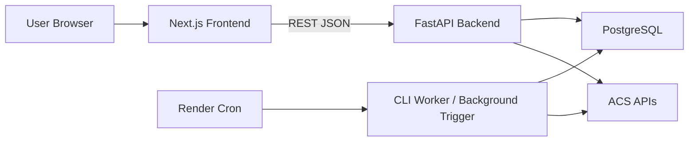

# Fraud Checker v2 Architecture Review Pack (Current Working Tree)

This file supersedes `docs/ai-architecture-review-pack.md`.

It is intended to be handed to an external principal/staff-level reviewer AI together with the repository. If the reviewer cannot read the repository, this document is still designed to carry enough context to produce a concrete architecture review.

## 1. Snapshot

- Project: `Fraud Checker v2`
- Scope: click/conversion ingest, suspicious traffic detection, read-only monitoring UI
- Architecture style: small-to-medium monolith
- Backend: FastAPI + SQLAlchemy + Alembic + psycopg
- Frontend: Next.js 16 + React 19 + TypeScript + Tailwind 4
- Primary data store: PostgreSQL
- Deployment target: Render
- Timezone model: `Asia/Tokyo`
- UI language: Japanese
- Frontend design system: `Sharp Operations`
- Base git HEAD in this workspace: `6a01900a18ea3fff5c689aaf2395caf40bdbe6c7`
- Important note: this pack describes the current working tree, which includes uncommitted Phase 1, Phase 2, and early Phase 3 changes beyond that HEAD

## 2. Review Goal

Review this system as a production-oriented fraud monitoring monolith with the following goals:

- correctness
- operational durability
- auditability
- performance
- maintainability
- security/privacy
- business usability

Constraints already chosen by the implementation direction:

- keep the monolith
- keep PostgreSQL as the single shared coordination/data system
- avoid introducing Kafka/Redis/Celery/microservices unless the current design truly cannot support the use case
- preserve the read-only monitoring value of the frontend
- keep Japanese UI
- keep existing API contracts backward-compatible where practical

## 3. What This System Does

The system ingests ACS click and conversion data, aggregates it by IP/User-Agent/media/program/day, computes suspicious findings, persists those findings, and exposes a monitoring UI for analysts.

There are four major backend workflows:

1. ingest click logs
2. ingest conversion logs
3. sync ACS masters
4. recompute suspicious findings for affected dates

The frontend is intentionally not an operations console for writes. It is a monitoring surface for:

- dashboard KPIs
- suspicious click findings
- suspicious conversion findings
- basic data freshness/quality visibility

## 4. Architectural Evolution Since The Previous Pack

This is the most important delta versus the older review pack.

### Phase 1 implemented

- durable `job_runs` table introduced
- lease-based job locking and stale recovery introduced
- API write endpoints enqueue jobs into PostgreSQL
- CLI worker path `python -m fraud_checker.cli run-worker` can process queued jobs safely
- runtime schema ensure calls removed from request flow/startup path
- production guards added for insecure flags
- health and summary endpoints now expose data freshness/coverage metrics
- structured logging and timing helpers added

### Phase 2 implemented

- suspicious findings are now persisted in:
  - `suspicious_click_findings`
  - `suspicious_conversion_findings`
- dashboard summary and daily stats read suspicious counts from persisted findings
- suspicious list APIs read persisted findings instead of request-time recomputation
- suspicious list now supports server-side pagination/search/filter/sort
- suspicious detail is fetched lazily by dedicated detail endpoints
- settings now have `updated_at`-based cache invalidation support via repository freshness lookup

### Phase 3 started

- `PostgresRepository` has been split internally into responsibility-specific repositories:
  - `IngestionRepository`
  - `ReportingReadRepository`
  - `SuspiciousReadRepository`
  - `MasterRepository`
  - `SettingsRepository`
  - shared `RepositoryBase`
- `PostgresRepository` still exists as a backward-compatible facade over these classes

This means the repository layer is no longer physically monolithic, but services and type hints still mostly depend on the facade.

## 5. Runtime Topology



Operationally:

- PostgreSQL is both the analytics store and the job coordination system
- API requests are synchronous reads for dashboard/list views
- write/admin actions enqueue durable jobs
- jobs may be kicked by API `BackgroundTasks`, but durability does not depend on in-process task survival
- a CLI worker can safely process queued jobs independently of API request lifecycle

## 6. High-Level Code Map

```text
backend/
  alembic/
    versions/
      0001_initial.py
      0002_add_ipua_date_ip_ua_index.py
      0003_add_job_runs.py
      0004_add_persisted_findings.py
  src/fraud_checker/
    api.py
    api_dependencies.py
    api_models.py
    api_parsers.py
    api_presenters.py
    acs_client.py
    cli.py
    config.py
    env.py
    ingestion.py
    job_status_pg.py
    logging_utils.py
    repository_pg.py
    runtime_guards.py
    suspicious.py
    models.py
    repositories/
      base.py
      ingestion.py
      reporting_read.py
      suspicious_read.py
      master.py
      settings.py
    services/
      e2e_seed.py
      findings.py
      jobs.py
      reporting.py
      settings.py
    api_routers/
      health.py
      jobs.py
      masters.py
      reporting.py
      settings.py
      suspicious.py
      testdata.py

frontend/
  src/
    app/
    components/
    hooks/
    lib/
  e2e/

docs/
  design-system.md
  test-strategy.md
  business-test-scenarios.md
  phase1-operations.md
  phase2-persisted-findings.md
  phase3-repository-split.md
```

## 7. Backend Architecture

### 7.1 Entrypoints

- API: `backend/src/fraud_checker/api.py`
- CLI: `backend/src/fraud_checker/cli.py`
- Local dev launcher: `dev.py`

### 7.2 Router Surface

#### Read endpoints

- `GET /`
- `GET /api/health`
- `GET /api/summary`
- `GET /api/stats/daily`
- `GET /api/dates`
- `GET /api/suspicious/clicks`
- `GET /api/suspicious/conversions`
- `GET /api/suspicious/clicks/{finding_key}`
- `GET /api/suspicious/conversions/{finding_key}`
- `GET /api/masters/status`
- `GET /api/job/status`
- `GET /api/settings`

#### Write/admin endpoints

- `POST /api/ingest/clicks`
- `POST /api/ingest/conversions`
- `POST /api/refresh`
- `POST /api/sync/masters`
- `POST /api/settings`

#### Test-only endpoints

- `POST /api/test/reset`
- `POST /api/test/seed/baseline`

### 7.3 Auth Model

This is still a service-level auth model, not user/session auth.

- admin endpoints require API key or bearer token
- test data endpoints require:
  - `FC_ENV=test`
  - `X-Test-Key`
- insecure flags now hard-fail in production

Important security characteristic:

- read endpoints are still effectively public if the deployment is not externally protected
- this is acceptable only if the deployment model assumes a private/internal environment or a reverse proxy/auth layer

### 7.4 Services

#### `services/jobs.py`

Responsibilities:

- enqueue durable jobs
- acquire and execute queued jobs
- heartbeat running jobs
- dispatch click ingest / conversion ingest / refresh / master sync

Key design:

- durability is in PostgreSQL
- execution can happen from API-triggered background kick or explicit CLI worker
- job lease timeout is configurable

#### `services/findings.py`

Responsibilities:

- recompute suspicious findings for affected dates
- replace current findings in persisted findings tables
- support refresh/settings/seed workflows that must refresh only impacted dates

#### `services/reporting.py`

Responsibilities:

- resolve target date
- build dashboard summary
- build daily stats series
- expose available dates

Current important behavior:

- suspicious counts now come from persisted findings, not from request-time detector execution
- raw click coverage and conversion enrichment quality metrics are included

#### `services/settings.py`

Responsibilities:

- load effective settings from env + DB
- persist settings
- invalidate local cache using DB `updated_at`
- trigger findings recomputation after settings updates

Important tradeoff:

- cache is still process-local
- invalidation is better than before because it compares DB `updated_at`
- this is still not a full shared-cache design, but acceptable for a small monolith

### 7.5 Suspicious Detection

`backend/src/fraud_checker/suspicious.py`

Current role:

- detection rules and detector composition still live here
- detection logic still executes in Python over repository-provided rollups
- persisted findings are generated from this logic, then reused by read APIs

Rule families:

- click volume
- click breadth across media/program
- click burst behavior
- conversion volume
- conversion breadth across media/program
- conversion burst behavior
- click-to-conversion gap thresholds
- optional browser-only filtering
- optional datacenter IP exclusion
- combined high-risk overlap

### 7.6 Repository Layer

Current state is transitional but materially improved.

#### Backward-compatible facade

- `backend/src/fraud_checker/repository_pg.py`
- class: `PostgresRepository`

This remains the import target for most services today.

#### Split repositories

- `RepositoryBase`
  - connection and generic SQL helpers
- `IngestionRepository`
  - raw ingest, merge, dedupe, conversion click enrichment
- `ReportingReadRepository`
  - dashboard and quality reads
- `SuspiciousReadRepository`
  - persisted findings list/detail/replace
- `MasterRepository`
  - master upsert and master freshness/counts
- `SettingsRepository`
  - settings read/write and `updated_at` freshness lookup

Important review point:

- the physical split exists
- service-level abstraction split does not yet fully exist
- this is a reasonable intermediate state, but the reviewer should assess whether and how far to continue the split

## 8. Data Model

### 8.1 Core tables

#### Raw / aggregate analytics tables

- `click_raw`
- `click_ipua_daily`
- `conversion_raw`
- `conversion_ipua_daily`

Aggregate grain:

- `(date, media_id, program_id, ipaddress, useragent)`

This keeps the system simple but can still produce wide cardinality if UA strings are highly variable.

### 8.2 Master tables

- `master_media`
- `master_promotion`
- `master_user`

These are used mainly to enrich suspicious detail responses and freshness indicators.

### 8.3 Settings table

- `app_settings`

Stores persisted rule overrides with `updated_at`.

### 8.4 Durable job table

- `job_runs`

Columns:

- `id`
- `job_type`
- `status`
- `params_json`
- `result_json`
- `error_message`
- `message`
- `queued_at`
- `started_at`
- `finished_at`
- `heartbeat_at`
- `locked_until`
- `worker_id`

Status set:

- `queued`
- `running`
- `succeeded`
- `failed`
- `cancelled`

Important design points:

- stale `running` jobs are re-queued when lease expires
- queue coordination is DB-native
- no external queue/broker is required

### 8.5 Persisted findings tables

- `suspicious_click_findings`
- `suspicious_conversion_findings`

Representative columns:

- `finding_key`
- `date`
- `ipaddress`
- `useragent`
- `ua_hash`
- `risk_level`
- `risk_score`
- `reasons_json`
- `reasons_formatted_json`
- `metrics_json`
- `rule_version`
- `computed_at`
- `is_current`
- `search_text`
- entity counts and time range columns
- name/id aggregation JSON columns

Current usage:

- dashboard summary reads counts from these tables
- daily stats reads counts from these tables
- suspicious list reads paginated rows from these tables
- row detail fetch uses finding row + detail bulk query for subordinate entity list

### 8.6 Legacy compatibility residue

The schema still contains:

- `job_status`

This exists mainly for older compatibility surface and model continuity. The durable job model is `job_runs`.

The repository still contains string IP/UA storage:

- `ipaddress` is `Text`, not `inet`
- `useragent` is stored raw, with a separate `ua_hash` only in findings tables

## 9. End-To-End Flows

### 9.1 Dashboard flow

1. frontend loads available dates
2. frontend loads summary and daily stats
3. backend reads:
   - aggregate tables
   - persisted findings counts
   - job freshness
   - click coverage / conversion enrichment metrics
4. frontend renders KPI strip and trend chart

### 9.2 Suspicious list flow

1. frontend loads available dates
2. frontend calls paginated list endpoint with:
   - `search`
   - `risk_level`
   - `sort_by`
   - `sort_order`
   - `limit`
   - `offset`
3. backend reads persisted findings table
4. frontend expands rows lazily using `GET /api/suspicious/*/{finding_key}`

This is materially better than the older in-memory/request-time detect flow.

### 9.3 Ingest flow

1. admin API or CLI requests ingest/refresh
2. backend enqueues `job_runs` row
3. API may kick `process_queued_jobs(1)` in-process
4. CLI worker can also process queued jobs
5. ingestors fetch ACS pages
6. repository merges raw/aggregate rows
7. findings are recomputed only for affected dates

### 9.4 Settings update flow

1. admin updates rule settings
2. DB settings persist to `app_settings`
3. local cache invalidates via `updated_at`
4. findings recompute for available dates

### 9.5 Master sync flow

1. admin API or CLI enqueues/runs master sync
2. ACS master endpoints are paged
3. local master tables are bulk upserted
4. health/summary freshness surfaces update from `updated_at`

## 10. Frontend Architecture

### 10.1 Product scope

The frontend remains intentionally narrow:

- dashboard
- suspicious clicks
- suspicious conversions

No broad admin UI has been introduced.

### 10.2 Data fetching

Current design:

- client-side fetches via `frontend/src/lib/api.ts`
- custom retry wrapper
- no React Query/SWR
- local hook state

#### Dashboard

- `use-dashboard-data.ts`
- loads dates, summary, daily stats

#### Suspicious list

- `use-suspicious-list.ts`
- maintains date/search/page/expanded row state
- uses server-side pagination/filter/sort
- defaults `includeDetails=false` and fetches details lazily

Important design tradeoff:

- still intentionally simple
- but URL state sync is not implemented yet
- page state is local only

### 10.3 UI system

The frontend uses the `Sharp Operations` design system:

- dark-first with optional light mode
- dense monitoring layout
- low-radius / border-first styling
- fixed shell framing
- read-oriented tables and metric strips

Key files:

- `docs/design-system.md`
- `frontend/src/components/app-shell.tsx`
- `frontend/src/components/ui/*`

### 10.4 Frontend operational behaviors

- sidebar has fixed open/closed widths
- theme toggle stored in `localStorage`
- suspicious lists hide secondary columns responsively to avoid horizontal overflow
- detail rows are fetched on demand rather than preloaded into list payloads

## 11. Deployment / Operations

### 11.1 Local dev

`dev.py` starts:

- backend on `8001`
- frontend on `3000`

### 11.2 Render

`render.yaml` defines:

- backend web service
- frontend web service
- PostgreSQL
- refresh cron
- master sync cron

Recommended job operation after Phase 1:

- keep web/API separate from durable queue execution semantics
- invoke `python -m fraud_checker.cli run-worker --max-jobs 1` from cron/worker style entrypoints

### 11.3 Observability

Current observability is still lightweight but improved:

- structured JSON logs
- processing-time logging helpers
- freshness and quality metrics exposed in API
- durable `job_runs` history

Still absent:

- metrics backend
- tracing
- alerting
- dedicated operational dashboards outside the product itself

## 12. Current Test State

Latest known local validation for the current working tree:

- backend: `123 passed, 1 skipped`
- frontend unit/component: `20 passed`
- frontend E2E: `5 passed`

Test layers present:

- backend unit/integration behavior tests
- frontend unit/component tests with Vitest + Testing Library + MSW
- Playwright E2E with test-only seed/reset endpoints

Key docs:

- `docs/test-strategy.md`
- `docs/business-test-scenarios.md`

## 13. Strengths

- architecture stayed monolithic and understandable despite meaningful improvements
- durable job execution is now DB-backed and restart-tolerant
- suspicious findings are now persisted and reused across reads
- server-side pagination/search/sort removed the largest Phase 2 read-path inefficiency
- data freshness and quality are now visible to operators
- repository split has started without breaking the external contract
- frontend remains focused and useful rather than bloating into an admin product

## 14. Remaining Review Hotspots

These are the most useful areas for a serious reviewer to challenge.

### 14.1 Service layer still depends on the repository facade

The physical repository split exists, but many modules still type against `PostgresRepository`.

Questions:

- should service constructors/type hints be narrowed now
- should a dedicated `JobRepository` be introduced next
- where should the repository split stop to avoid over-engineering

### 14.2 Detection computation is persisted but still recomputed in Python

The biggest request-time issue is solved, but findings recomputation is still Python-driven over rollups.

Questions:

- is this acceptable at expected scale
- should some parts move to SQL/materialized staging
- is there a future need for incremental-by-partition recompute beyond date-level granularity

### 14.3 IP/UA physical modeling is still basic

Open areas:

- `ipaddress` is not `inet`
- UA values are still raw `Text`
- `ua_hash` only exists in findings, not as a broader dimension strategy

### 14.4 Settings consistency is improved but still process-local

The `updated_at` check makes cache invalidation workable, but this is still not perfect under higher multi-instance concurrency.

### 14.5 Public read endpoints may still be too open

The system assumes a read-only monitoring deployment, but findings and IP/UA data are sensitive.

The reviewer should evaluate whether:

- outer auth is mandatory
- read endpoints should become authenticated
- IP/UA should be masked or partially redacted in some contexts

### 14.6 Data lifecycle remains unaddressed

Still missing:

- retention policy
- partitioning
- archival
- explicit raw table growth strategy

### 14.7 Triage/annotation workflow does not exist yet

Findings are analytical outputs only.

Not yet implemented:

- analyst annotation
- suppression
- false-positive marking
- assignee/status workflow

## 15. Concrete Questions For The Reviewer

Please answer these concretely:

1. Is the current durable job design sufficient for Render + PostgreSQL, or should queue execution be separated further while still staying monolithic?
2. Is the persisted-findings design appropriate, or should findings be modeled differently for auditability and recomputation cost?
3. How far should the repository split continue before diminishing returns set in?
4. Is the current aggregate grain `(date, media_id, program_id, ipaddress, useragent)` the right long-term shape?
5. What is the minimum acceptable privacy/security posture for read endpoints exposing IP/UA-based findings?
6. What is the most cost-effective next step for data lifecycle management?
7. What are the top three remaining correctness risks?
8. What are the top three remaining operability risks?
9. What refactor sequence would you recommend for the next two to four small PRs?

## 16. Suggested Reviewer Prompt

> Review this repository as a production-oriented fraud monitoring monolith running on Render + PostgreSQL. Assume the team wants to keep the monolith and avoid adding heavyweight infrastructure unless absolutely necessary. Prioritize correctness, durability, operability, performance, maintainability, security/privacy, and business usability. Be concrete. Focus on the current working tree described in this pack, including durable `job_runs`, persisted suspicious findings, and the early repository split. Identify the remaining design risks, what should change next, what should not change yet, and give a small-PR refactor sequence with tradeoffs.

## 17. Files To Inspect First

Recommended read order for an external reviewer:

1. `backend/src/fraud_checker/api.py`
2. `backend/src/fraud_checker/api_routers/jobs.py`
3. `backend/src/fraud_checker/services/jobs.py`
4. `backend/src/fraud_checker/job_status_pg.py`
5. `backend/src/fraud_checker/services/findings.py`
6. `backend/src/fraud_checker/api_routers/suspicious.py`
7. `backend/src/fraud_checker/services/reporting.py`
8. `backend/src/fraud_checker/suspicious.py`
9. `backend/src/fraud_checker/db/models.py`
10. `backend/src/fraud_checker/repository_pg.py`
11. `backend/src/fraud_checker/repositories/*.py`
12. `backend/src/fraud_checker/services/settings.py`
13. `frontend/src/lib/api.ts`
14. `frontend/src/hooks/use-dashboard-data.ts`
15. `frontend/src/hooks/use-suspicious-list.ts`
16. `frontend/src/components/suspicious-list-page.tsx`
17. `frontend/src/components/app-shell.tsx`
18. `render.yaml`
19. `docs/design-system.md`
20. `docs/test-strategy.md`

## 18. Important Notes

- Some Windows terminal output in this repository can show Japanese mojibake even when the source files are correct. Treat the file contents and browser rendering as source of truth.
- `docs/phase2-persisted-findings.md` and `docs/phase3-repository-split.md` currently contain mojibake in terminal rendering. Their intent is still valid, but this review pack is the cleaner summary of the current state.
- This pack is intentionally explicit about transitional states. Not every remaining rough edge is a bug; some are deliberate stopping points to preserve a safe migration path.
