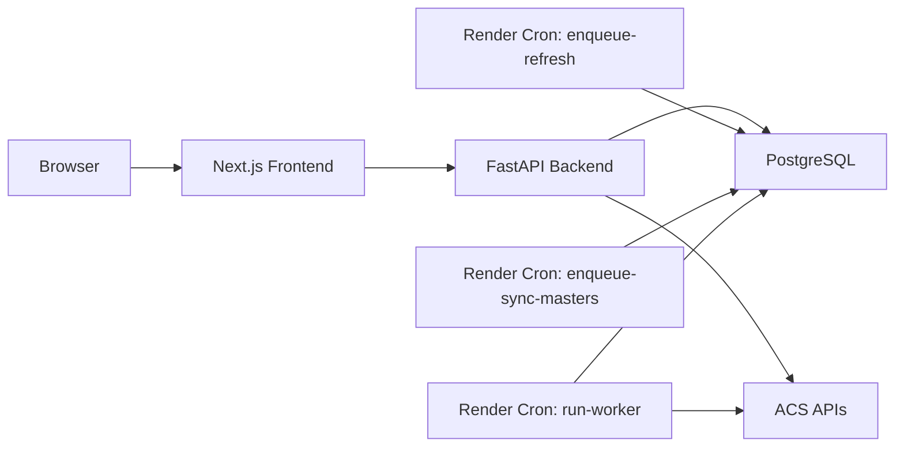

# Fraud Checker v2 Architecture Review Pack v3

This document is the current review handoff for an external principal/staff-level reviewer AI.

Use this file together with the repository. If the reviewer cannot read the repository, this file is intended to still contain enough information to produce concrete architecture criticism and actionable improvement proposals.

---

## 1. Executive Summary

`Fraud Checker v2` is a production-oriented fraud monitoring monolith for affiliate traffic.

It does four core things:

1. ingest ACS click data
2. ingest ACS conversion data
3. sync ACS master data
4. compute and serve suspicious findings for analysts

Current architecture direction:

- keep the monolith
- keep PostgreSQL as the single shared system of record and coordination layer
- avoid Redis/Kafka/Celery/microservices
- keep the frontend read-oriented
- keep the UI in Japanese
- keep Render as the deployment target

Current maturity level:

- materially beyond a prototype
- durable jobs exist
- suspicious findings are persisted
- server-side pagination/search/filter/sort exists
- lineage and freshness are partially visible
- repository split has started
- tests are already strong

Current HEAD:

- `e8ddd019d03d829f5206a1bb21a81f2025e70db0`

---

## 2. What The System Is For

This is not an ad-hoc data script and not a general BI platform.

It is a focused fraud monitoring system for affiliate traffic with these user-facing jobs:

- monitor daily click/conversion volume
- highlight suspicious IP/User-Agent activity
- inspect suspicious findings with drill-down details
- see data freshness and basic quality indicators
- manually trigger admin-side data synchronization

The current frontend is intentionally a monitoring surface, not a full operations console.

---

## 3. Stack Snapshot

### Backend

- Python 3.12
- FastAPI
- SQLAlchemy
- Alembic
- psycopg / PostgreSQL

### Frontend

- Next.js 16
- React 19
- TypeScript
- Tailwind 4

### Infra / Runtime

- Render
- PostgreSQL on Render
- Cron-driven worker model
- Timezone: `Asia/Tokyo`

### Architectural Style

- small-to-medium monolith
- PostgreSQL-backed analytics + coordination
- synchronous reads
- async durable writes via job queue

---

## 4. Current Production Model

The current intended production model is:

- web app receives admin requests
- admin write endpoints enqueue durable jobs into PostgreSQL
- Render cron runs a queue worker every minute
- worker acquires queued jobs via lease-based locking and executes them
- reads are served synchronously from persisted analytics/findings tables

This is an explicit choice to avoid request-time execution of heavy write workflows.

### Runtime topology

### Render services

From `render.yaml`:

- `fraudchecker-backend`
  - FastAPI web service
- `fraudchecker-frontend`
  - Next.js web service
- `fraudchecker-refresh-hourly`
  - `python -m fraud_checker.cli enqueue-refresh --hours 1 --detect`
- `fraudchecker-sync-masters-daily`
  - `python -m fraud_checker.cli enqueue-sync-masters`
- `fraudchecker-queue-runner-minute`
  - `python -m fraud_checker.cli run-worker --max-jobs 5`

Important production flag:

- `FC_ENABLE_IN_PROCESS_JOB_KICK=false`

Meaning:

- production should not rely on in-process FastAPI background execution
- the durable queue + worker cron is the primary execution path

---

## 5. Request / Job / Data Flow

### 5.1 Dashboard Read Flow

1. frontend requests `GET /api/summary`
2. backend reads:
   - click aggregates
   - conversion aggregates
   - persisted findings counts
   - job freshness metrics
   - master freshness
3. backend returns:
   - top-line KPIs
   - suspicious counts
   - data quality/freshness block

Important:

- suspicious counts are now read from persisted findings
- they are not recomputed on request

### 5.2 Suspicious List Flow

1. frontend requests `GET /api/suspicious/clicks` or `/conversions`
2. backend reads persisted findings with:
   - date
   - search
   - risk filter
   - sort
   - limit/offset
3. list response masks IP/UA by default
4. when a row is expanded, frontend requests detail endpoint by `finding_key`
5. detail returns full sensitive values and joined detail rows

Important:

- list is masked
- detail is unmasked
- list supports server-side pagination/search/filter/sort
- detail is lazy loaded

### 5.3 Manual Sync Flow

1. admin UI or admin client calls:
   - `POST /api/refresh`
   - `POST /api/sync/masters`
   - `POST /api/ingest/*`
2. backend enqueues durable job into `job_runs`
3. API returns `job_id`
4. frontend or operator polls `GET /api/job/status`
5. queue runner cron picks the job up within roughly one minute

### 5.4 Scheduled Sync Flow

1. Render cron calls enqueue CLI
2. enqueue CLI writes durable job into PostgreSQL
3. separate queue runner cron executes queued jobs
4. jobs update raw/aggregate/findings/master tables

This means manual and scheduled flows share one durable path.

### 5.5 Findings Recompute Flow

Findings recompute is triggered by:

- click ingest
- conversion ingest
- refresh
- settings updates
- test seed baseline

Current behavior:

- recompute only affected dates
- compute click findings
- compute conversion findings
- replace current rows in persisted findings tables
- persist lineage metadata:
  - `computed_by_job_id`
  - `settings_updated_at_snapshot`
  - `source_click_watermark`
  - `source_conversion_watermark`
  - `generation_id`

---

## 6. Backend Code Map

### Entry points

- `backend/src/fraud_checker/api.py`
- `backend/src/fraud_checker/cli.py`
- `backend/src/fraud_checker/dev.py` or root `dev.py` depending on launch path

### Router layer

- `backend/src/fraud_checker/api_routers/health.py`
- `backend/src/fraud_checker/api_routers/jobs.py`
- `backend/src/fraud_checker/api_routers/masters.py`
- `backend/src/fraud_checker/api_routers/reporting.py`
- `backend/src/fraud_checker/api_routers/settings.py`
- `backend/src/fraud_checker/api_routers/suspicious.py`
- `backend/src/fraud_checker/api_routers/testdata.py`

### Service layer

- `backend/src/fraud_checker/services/jobs.py`
- `backend/src/fraud_checker/services/findings.py`
- `backend/src/fraud_checker/services/reporting.py`
- `backend/src/fraud_checker/services/settings.py`
- `backend/src/fraud_checker/services/lifecycle.py`
- `backend/src/fraud_checker/services/e2e_seed.py`

### Detection / ingestion

- `backend/src/fraud_checker/suspicious.py`
- `backend/src/fraud_checker/ingestion.py`
- `backend/src/fraud_checker/acs_client.py`

### Repository layer

- `backend/src/fraud_checker/repository_pg.py`
- `backend/src/fraud_checker/repositories/base.py`
- `backend/src/fraud_checker/repositories/ingestion.py`
- `backend/src/fraud_checker/repositories/reporting_read.py`
- `backend/src/fraud_checker/repositories/suspicious_read.py`
- `backend/src/fraud_checker/repositories/master.py`
- `backend/src/fraud_checker/repositories/settings.py`

### Coordination / platform support

- `backend/src/fraud_checker/job_status_pg.py`
- `backend/src/fraud_checker/runtime_guards.py`
- `backend/src/fraud_checker/logging_utils.py`
- `backend/src/fraud_checker/service_protocols.py`

---

## 7. API Surface

### Public/read APIs

- `GET /`
- `GET /api/health`
- `GET /api/summary`
- `GET /api/stats/daily`
- `GET /api/dates`
- `GET /api/suspicious/clicks`
- `GET /api/suspicious/conversions`
- `GET /api/suspicious/clicks/{finding_key}`
- `GET /api/suspicious/conversions/{finding_key}`
- `GET /api/masters/status`
- `GET /api/job/status`
- `GET /api/settings`

### Admin/write APIs

- `POST /api/ingest/clicks`
- `POST /api/ingest/conversions`
- `POST /api/refresh`
- `POST /api/sync/masters`
- `POST /api/settings`

### Test-only APIs

- `POST /api/test/reset`
- `POST /api/test/seed/baseline`

### Current auth posture

- admin endpoints require admin API key / bearer path
- test endpoints require `FC_ENV=test` and test key
- read endpoints can be protected by read auth flags, but operationally they still depend on deployment posture

Important review topic:

- this system still needs a crisp final decision on read access posture in production
- current implementation supports stricter posture, but reviewer should assess whether the defaults are strong enough

---

## 8. Database Schema Summary

### Raw / aggregate tables

- `click_raw`
- `click_ipua_daily`
- `conversion_raw`
- `conversion_ipua_daily`

Aggregate grain is effectively:

- `(date, media_id, program_id, ipaddress, useragent)`

### Master tables

- `master_media`
- `master_promotion`
- `master_user`

### Settings table

- `app_settings`

### Legacy table still present

- `job_status`

Important:

- this is legacy residue
- `job_runs` is the real durable coordination path now
- reviewer should evaluate whether `job_status` can be retired or reduced further

### Durable job table

- `job_runs`

Key columns:

- `id`
- `job_type`
- `status`
- `params_json`
- `result_json`
- `error_message`
- `message`
- `attempt_count`
- `max_attempts`
- `next_retry_at`
- `dedupe_key`
- `priority`
- `queued_at`
- `started_at`
- `finished_at`
- `heartbeat_at`
- `locked_until`
- `worker_id`

Key queue indexes:

- `idx_job_runs_status_queued_at`
- `idx_job_runs_job_type_queued_at`
- `idx_job_runs_locked_until`
- `idx_job_runs_queue_scan`
- `idx_job_runs_dedupe_status`

### Persisted findings tables

- `suspicious_click_findings`
- `suspicious_conversion_findings`

Key columns:

- `finding_key`
- `date`
- `ipaddress`
- `useragent`
- `ua_hash`
- `media_ids_json`
- `program_ids_json`
- `media_names_json`
- `program_names_json`
- `affiliate_names_json`
- `risk_level`
- `risk_score`
- `reasons_json`
- `reasons_formatted_json`
- `metrics_json`
- count fields
- time fields
- `rule_version`
- `computed_at`
- `computed_by_job_id`
- `settings_updated_at_snapshot`
- `source_click_watermark`
- `source_conversion_watermark`
- `generation_id`
- `is_current`
- `search_text`

Key findings indexes:

- `idx_scf_date_current`
- `idx_scf_date_current_risk`
- `idx_scf_date_current_computed`
- `idx_scof_date_current`
- `idx_scof_date_current_risk`
- `idx_scof_date_current_computed`

### Migrations currently present

- `0001_initial.py`
- `0002_add_ipua_date_ip_ua_index.py`
- `0003_add_job_runs.py`
- `0004_add_persisted_findings.py`
- `0005_add_findings_lineage.py`
- `0006_add_job_run_controls.py`

---

## 9. Repository / Service Architecture

### Current repository split state

`PostgresRepository` is now a backward-compatible facade over split repositories:

- `IngestionRepository`
- `ReportingReadRepository`
- `SuspiciousReadRepository`
- `MasterRepository`
- `SettingsRepository`

This is a meaningful improvement versus the earlier single giant repository.

### Current service protocols

`service_protocols.py` defines narrow protocol dependencies for:

- `ReportingRepository`
- `FindingsRepository`
- `SettingsRepository`
- `LifecycleRepository`

This means the codebase has started moving toward narrower service dependencies, but it is not complete yet.

### Important reviewer topic

The split is now physically real, but there is still a design question:

- how far should the split go before it becomes over-engineering for a monolith of this size?

Good review output here would be:

- final desired repository boundaries
- which services should still depend on the facade
- which services should be fully narrowed to protocols
- what not to split further

---

## 10. Durable Job Model

The job system is now one of the most important backend subsystems.

### Current behavior

- jobs are enqueued durably into PostgreSQL
- duplicate active jobs with same `dedupe_key` return existing run
- a worker acquires jobs with `FOR UPDATE SKIP LOCKED`
- running jobs heartbeat lease extension
- stale running jobs are recovered to queued
- retries use backoff and `next_retry_at`
- queue metrics are visible via health/status paths

### Job types

- `ingest_clicks`
- `ingest_conversions`
- `refresh`
- `master_sync`

### Current operational model

- production web path is enqueue-only
- regular execution should happen through `run-worker`
- inline CLI execution still exists as break-glass path only

### Important reviewer topics

- correctness of dedupe strategy
- whether allowing different job types to queue simultaneously is the right tradeoff
- retry/backoff settings
- queue latency versus simplicity on Render
- whether every minute cron worker is enough
- whether `job_status` compatibility layer should be retired

---

## 11. Findings Computation Model

This system used to recompute suspicious findings at request time.

That is no longer true.

### Current model

- suspicious detection logic still lives in Python
- recomputation is triggered by writes, not reads
- findings are persisted and reused by read endpoints

### Detection families currently represented

- click volume threshold
- click spread across media/program
- click burst behavior
- conversion volume threshold
- conversion spread across media/program
- conversion burst behavior
- click-to-conversion timing anomalies
- combined high-risk overlap

### Current lineage captured

- `computed_by_job_id`
- `settings_updated_at_snapshot`
- `source_click_watermark`
- `source_conversion_watermark`
- `generation_id`
- `computed_at`
- `rule_version`

### Important reviewer topics

- whether lineage is now sufficient for auditability
- whether `search_text` is too coupled to mutable master names
- whether `is_current` replacement strategy is sufficient under overlapping recomputes
- whether findings should evolve toward more normalized structures later

---

## 12. Reporting / Freshness / Quality Model

### Summary endpoint now includes:

- click totals
- conversion totals
- suspicious counts from persisted findings
- `last_successful_ingest_at`
- click IP/UA missing-rate coverage
- conversion click-enrichment success rate
- findings freshness:
  - `findings_last_computed_at`
  - stale boolean
  - stale reasons
- master sync freshness

### Important reviewer topic

The code now distinguishes:

- raw ingest freshness
- findings freshness

This was a deliberate improvement because they are not the same thing.

The reviewer should still assess:

- whether stale detection rules are complete
- whether health should expose stronger SLO signals
- whether summary/health split is correctly scoped

---

## 13. Frontend Architecture

### Frontend purpose

The frontend is a read-oriented monitoring UI.

It does not own write-side complexity beyond:

- manual admin actions
- polling status
- rendering monitoring surfaces

### Main frontend areas

- dashboard
- suspicious clicks list
- suspicious conversions list
- settings/admin surfaces where applicable

### Current frontend behavior

- list pages use server-side pagination/search/filter/sort
- detail rows are lazy fetched by `finding_key`
- date/search/page/risk/sort are synced to URL state
- API retries exist in the client layer
- list rows mask sensitive values by default

### Important frontend files

- `frontend/src/lib/api.ts`
- `frontend/src/hooks/use-suspicious-list.ts`
- `frontend/src/components/suspicious-list-page.tsx`
- `frontend/src/components/suspicious-row-details.tsx`
- `frontend/src/app/page.tsx`

### Design system direction

- dark monitoring UI called `Sharp Operations`
- Japanese UI
- high-density, line/contrast-driven layout
- not card-heavy
- read-optimized dashboard/list surface

### Important reviewer topics

- whether the frontend is exposing the right operational state
- whether masked list vs full detail is sufficient privacy posture
- whether URL state sync is complete enough
- whether dashboard/list boundaries are appropriate

---

## 14. Security / Privacy State

### Stronger than before

- admin write endpoints are not public
- insecure runtime flags hard-fail in production
- findings list masks IP/UA by default
- full values are returned only in detail endpoints
- docs and health/reporting now reflect more production-oriented expectations

### Still open / review-worthy

- read endpoint protection posture may still depend too much on deployment assumptions
- IP and UA are still stored as raw text
- evidence retention and exposure policy need continued scrutiny
- there is no analyst-level RBAC or user model

Reviewer should explicitly assess:

- minimum acceptable production posture for read access
- whether masked list + unmasked detail is enough
- whether additional field-level redaction or audit logging is needed

---

## 15. Data Lifecycle State

A first lifecycle pass is implemented.

### Current retention defaults

- raw: 90 days
- aggregates: 365 days
- findings: 365 days
- finished job runs: 30 days

### Current tooling

- `python -m fraud_checker.cli purge-data`
- default mode is dry-run
- `--execute` actually deletes

### Not yet fully solved

- partitioning
- archival export
- exact long-term evidence policy
- lifecycle interactions with future triage/annotation data

---

## 16. Test State

The repo already has a strong test base compared with its size.

Current testing categories:

- backend unit/behavior tests
- API behavior tests
- job queue tests
- findings/reporting tests
- repository split tests
- frontend unit/component tests
- Playwright E2E tests

The external reviewer should assume:

- regression protection is reasonably good
- architectural changes can be proposed with confidence
- but concurrency/performance/large-data tests are still thinner than behavior correctness tests

---

## 17. Known Technical Debt / Open Risks

These are the most important current issues for review.

### A. Encoding / mojibake regression exists in current working tree

This is important.

Several files currently show mojibake or corrupted Japanese strings when read from disk, including examples in:

- `backend/src/fraud_checker/services/jobs.py`
- `frontend/src/hooks/use-suspicious-list.ts`
- `frontend/src/components/suspicious-list-page.tsx`
- `docs/render-job-flow.md`

This may be:

- an actual repo state issue
- a Windows encoding handling issue
- a CRLF/UTF-8 mismatch in specific files

The reviewer should treat this as a real maintainability and product-quality issue, not just presentation noise.

### B. Legacy `job_status` residue still exists

The durable queue exists, but a legacy singleton table still remains in the schema/model surface.

### C. Repository split is incomplete by design

The current state is intentionally transitional. It is better than before, but not final.

### D. Search text may be over-coupled to mutable enrichment data

`search_text` currently includes names that come from masters and formatted reasons.

This improves business usability but creates questions around:

- master sync changes
- reindexing/recompute expectations
- search consistency over time

### E. Exact future path for triage/annotation is still open

There is not yet a full reviewer workflow with:

- status
- assignee
- note
- false positive
- suppression

### F. Raw IP/UA model is still simple text

Potential future growth topics remain:

- `inet`
- `ip_prefix`
- `asn`
- `ua_hash` normalization
- user-agent dimension tables

---

## 18. What Changed Most Recently

The latest notable shift is the Render execution model.

### Before

- cron directly executed refresh/sync inline
- API could also kick in-process work

### Now

- cron mostly enqueues work
- worker cron executes work
- manual admin API and scheduled jobs share the same durable path

This change is captured in:

- `render.yaml`
- `backend/src/fraud_checker/services/jobs.py`
- `backend/src/fraud_checker/cli.py`
- `docs/render-job-flow.md`

This is a deliberate simplification for Render.

---

## 19. Questions The Reviewer Should Answer

Please review this codebase as if you are the principal/staff engineer responsible for making it durable, correct, simple, and production-worthy without over-architecting it.

Specific questions:

1. Is the current Render execution model the right balance of simplicity and durability?
2. Is PostgreSQL-only coordination still the correct choice at the current scale and foreseeable scale?
3. Is the durable job model correct enough, or are there correctness holes around concurrency, retries, or dedupe?
4. Is the findings persistence/lineage model sufficient for auditability and correctness?
5. Is the repository split at the right stopping point, or should it be finished further?
6. What is the minimum acceptable production read-access posture for this system?
7. What are the biggest remaining scalability bottlenecks?
8. What are the biggest maintainability risks?
9. What would you change next in the smallest safe sequence of PRs?
10. Which current design choices should explicitly *not* be changed yet?

---

## 20. Requested Reviewer Output Format

The best reviewer response would include:

### 1. Diagnosis

- Critical
- High
- Medium

### 2. Architecture judgment

- what is already good and should be preserved
- what is directionally correct but incomplete
- what is actively risky or wrong

### 3. Concrete implementation plan

- next 3 to 6 small PRs
- exact files/subsystems to touch
- schema/index changes if needed
- API compatibility impact
- rollback notes

### 4. Tradeoffs

- what not to do yet
- what would be over-engineering
- where simplicity should win over ideal purity

### 5. Risks and validation

- required tests
- required observability
- migration safety checks

---

## 21. Short Reviewer Prompt

Use the following prompt if you want to hand this pack to another AI:

> You are a principal engineer reviewing a production-oriented fraud monitoring monolith running on Render + PostgreSQL. Read this architecture pack and, if available, inspect the repository. Your goals are correctness, durability, auditability, security/privacy, performance, maintainability, and business usability. Keep the monolith. Keep PostgreSQL as the single coordination/data system. Avoid Redis/Kafka/Celery/microservices unless absolutely necessary. Give a concrete diagnosis ranked by Critical/High/Medium, then propose the next small PR sequence with file-level specificity, schema/index changes, test plan, rollback plan, and explicit tradeoffs. Also call out anything that should not be changed yet.

---

## 22. Final Notes

- This pack intentionally emphasizes concrete operational behavior over abstract architecture language.
- The most important current systems are:
  - durable jobs
  - persisted findings
  - Render cron/worker execution
  - masked list vs unmasked detail
  - freshness/lineage visibility
- The highest-value review will focus on the remaining sharp edges without breaking the system's current simplicity.
