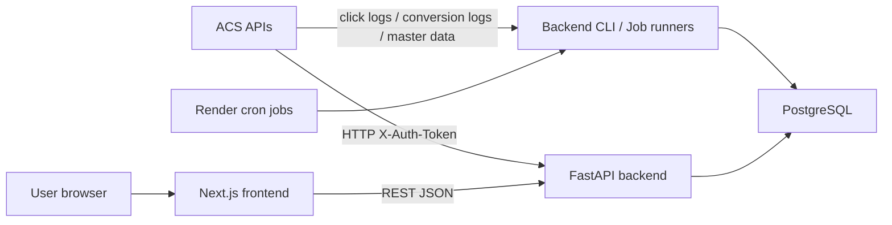

# Fraud Checker v2 Architecture Review Pack

This document is intended to be handed to an external design-review AI as a complete project context pack.

If the external AI can read the repository directly, give it both this file and the codebase. If it cannot, this file should still provide enough structure, vocabulary, and file references to perform a meaningful architecture review.

## Project Snapshot

- Project: `Fraud Checker v2`
- Purpose: ingest click/conversion data from ACS, aggregate by IP/User-Agent, detect suspicious patterns, and expose a read-only operational dashboard
- Current branch: `master`
- Current HEAD: `d5aa826687d2c51bca61e3707857b9fdb60b344d`
- Stack:
  - Backend: Python 3.11+/FastAPI/SQLAlchemy/Alembic/psycopg
  - Frontend: Next.js 16 / React 19 / TypeScript / Tailwind 4
  - Database: PostgreSQL
  - Deployment target: Render
- Timezone model: `Asia/Tokyo` by default
- UI language: Japanese
- Design system: Sharp Operations, dark-first with optional light mode

## What This System Does

The system has four major jobs:

1. Pull click logs from ACS.
2. Pull conversion logs from ACS and preserve entry IP/UA information where available.
3. Aggregate both datasets by `(date, media_id, program_id, ipaddress, useragent)`.
4. Detect suspicious IP/UA patterns and expose them through:
   - dashboard summary metrics
   - suspicious click list
   - suspicious conversion list

The frontend is intentionally read-only for analytics and review. Administrative operations exist in the backend API and CLI for refresh, ingestion, master sync, settings, and health checks.

## Review Request To The External AI

Please review this system as a production-oriented analytics/monitoring platform. Focus on:

- architectural cohesion and separation of concerns
- data model fit for the problem domain
- correctness and durability of ingestion + aggregation + detection flows
- performance/scalability risks under larger datasets
- background job robustness
- API contract quality
- frontend data-fetching design and UI maintainability
- operational safety, deployability, and observability
- security model and environment handling

Please prioritize:

1. concrete bugs or correctness risks
2. design flaws that will hurt scale or operability
3. unnecessary complexity or poor boundaries
4. opportunities for simplification

## How To Read This Codebase

Recommended inspection order:

1. `backend/src/fraud_checker/api.py`
2. `backend/src/fraud_checker/api_routers/*.py`
3. `backend/src/fraud_checker/services/jobs.py`
4. `backend/src/fraud_checker/services/reporting.py`
5. `backend/src/fraud_checker/suspicious.py`
6. `backend/src/fraud_checker/repository_pg.py`
7. `backend/src/fraud_checker/db/models.py`
8. `frontend/src/lib/api.ts`
9. `frontend/src/hooks/use-dashboard-data.ts`
10. `frontend/src/hooks/use-suspicious-list.ts`
11. `frontend/src/app/page.tsx`
12. `frontend/src/components/suspicious-list-page.tsx`
13. `render.yaml`
14. `docs/test-strategy.md`

## Repository Map

```text
.
|- backend/
|  |- alembic/
|  |- src/fraud_checker/
|  |  |- api_routers/
|  |  |- db/
|  |  |- services/
|  |  |- acs_client.py
|  |  |- api.py
|  |  |- api_dependencies.py
|  |  |- api_models.py
|  |  |- api_presenters.py
|  |  |- cli.py
|  |  |- config.py
|  |  |- env.py
|  |  |- ingestion.py
|  |  |- job_status_pg.py
|  |  |- models.py
|  |  |- repository_pg.py
|  |  |- suspicious.py
|  |  |- time_utils.py
|  |- tests/
|- frontend/
|  |- e2e/
|  |- src/
|  |  |- app/
|  |  |- components/
|  |  |- hooks/
|  |  |- lib/
|  |  |- test/
|  |- package.json
|  |- playwright.config.ts
|- docs/
|  |- design-system.md
|  |- test-strategy.md
|  |- business-test-scenarios.md
|- dev.py
|- render.yaml
|- README.md
```

## Runtime Topology



## End-To-End Data Flows

### 1. Dashboard read flow

1. Browser loads `frontend/src/app/page.tsx`.
2. `useDashboardData()` fetches available dates, summary, and daily stats.
3. Frontend calls:
   - `GET /api/dates`
   - `GET /api/summary`
   - `GET /api/stats/daily`
4. Backend computes summary and chart data using live DB queries plus on-demand suspicious detection counts.
5. Frontend renders KPI strip and chart.

### 2. Suspicious list flow

1. Browser loads either:
   - `frontend/src/app/suspicious/clicks/page.tsx`
   - `frontend/src/app/suspicious/conversions/page.tsx`
2. `useSuspiciousList()` loads dates, search state, pagination state, and current list data.
3. Frontend calls either:
   - `GET /api/suspicious/clicks`
   - `GET /api/suspicious/conversions`
4. Backend:
   - resolves date
   - builds rule sets
   - runs suspicious detection for the date
   - optionally loads bulk detail rows for name-based search and UI expansion payloads
   - paginates in memory after detection
5. Frontend renders table rows and expandable detail panels.

### 3. Refresh / ingest flow

1. Admin or cron hits refresh/ingest endpoints or CLI commands.
2. Backend enqueues a job through `BackgroundTasks`.
3. Job state is persisted in `job_status`.
4. Runner instantiates ACS client + repository + ingestors.
5. Data is written into raw tables and/or aggregate tables.
6. Optional suspicious detection runs for affected dates.

### 4. Master sync flow

1. Admin API or CLI triggers master sync.
2. ACS master endpoints are paged until exhausted.
3. Repository bulk-upserts `master_media`, `master_promotion`, `master_user`.

### 5. E2E test flow

1. Playwright starts backend with `FC_ENV=test`.
2. Test-only endpoints `/api/test/reset` and `/api/test/seed/baseline` become available.
3. Tests seed deterministic data, then hit the real frontend and backend.

## Backend Architecture

### Entry Points

- API entrypoint: `backend/src/fraud_checker/api.py`
- CLI entrypoint: `backend/src/fraud_checker/cli.py`
- Render backend service start command:
  - `python -m uvicorn fraud_checker.api:app --host 0.0.0.0 --port $PORT --app-dir ./src`
- Local dev multiprocess launcher:
  - `dev.py`

### API Router Surface

| Endpoint | Method | Auth | Responsibility | Source |
| --- | --- | --- | --- | --- |
| `/` | GET | none | root health banner | `api_routers/health.py` |
| `/api/health` | GET | admin | config + DB + master-data health | `api_routers/health.py` |
| `/api/summary` | GET | none | dashboard KPI summary | `api_routers/reporting.py` |
| `/api/stats/daily` | GET | none | daily trend data | `api_routers/reporting.py` |
| `/api/dates` | GET | none | available dates for UI | `api_routers/reporting.py` |
| `/api/suspicious/clicks` | GET | none | suspicious click list | `api_routers/suspicious.py` |
| `/api/suspicious/conversions` | GET | none | suspicious conversion list | `api_routers/suspicious.py` |
| `/api/ingest/clicks` | POST | admin | enqueue click ingest for a date | `api_routers/jobs.py` |
| `/api/ingest/conversions` | POST | admin | enqueue conversion ingest for a date | `api_routers/jobs.py` |
| `/api/refresh` | POST | admin | enqueue lookback refresh | `api_routers/jobs.py` |
| `/api/job/status` | GET | none | latest singleton job state | `api_routers/jobs.py` |
| `/api/sync/masters` | POST | admin | enqueue master sync | `api_routers/masters.py` |
| `/api/masters/status` | GET | none | counts/snapshots of master data | `api_routers/masters.py` |
| `/api/settings` | GET | admin | read detection settings | `api_routers/settings.py` |
| `/api/settings` | POST | admin | update detection settings | `api_routers/settings.py` |
| `/api/test/reset` | POST | test-only key | reset E2E data | `api_routers/testdata.py` |
| `/api/test/seed/baseline` | POST | test-only key | seed E2E data | `api_routers/testdata.py` |

### Authentication / Authorization

Backend auth is header-based and intentionally simple.

- Admin auth:
  - `X-API-Key`
  - or `Authorization: Bearer ...`
- Admin auth bypass:
  - allowed when `FC_ENV` is `dev`, `development`, or `local`
  - or when `FC_ALLOW_INSECURE_ADMIN=true`
- Test-only endpoints:
  - require `FC_ENV=test`
  - require `X-Test-Key`
  - expected key is `FC_E2E_TEST_KEY`

Important review note:

- this system has no user/session model
- auth is service-level, not user-level
- frontend is mostly read-only and does not appear to expose admin flows in the current UI

### Configuration Model

Configuration lives in:

- `.env.example`
- environment variables
- `backend/src/fraud_checker/config.py`
- DB-backed settings through `app_settings`

Precedence pattern:

1. hardcoded defaults in `config.py`
2. env variables
3. DB settings loaded through `services/settings.py`

Operationally important env vars:

| Variable | Purpose |
| --- | --- |
| `DATABASE_URL` | PostgreSQL connection |
| `ACS_BASE_URL` | ACS root URL |
| `ACS_ACCESS_KEY` / `ACS_SECRET_KEY` or `ACS_TOKEN` | ACS auth |
| `FC_ADMIN_API_KEY` | admin endpoint auth |
| `FC_ENV` | environment mode, controls test/admin behavior |
| `FC_ALLOW_INSECURE_ADMIN` | local/test bypass switch |
| `FC_CORS_ORIGINS` | API CORS allowlist |
| `ACS_ALLOW_INSECURE` | allow non-HTTPS ACS URL |
| `FRAUD_TIMEZONE` | timezone parsing + reporting |
| `NEXT_PUBLIC_API_URL` | frontend API base |

### Domain Model

Backend domain dataclasses live in `backend/src/fraud_checker/models.py`.

Core concepts:

- `ClickLog`
- `ConversionLog`
- `IpUaRollup`
- `ConversionIpUaRollup`
- `SuspiciousFinding`
- `SuspiciousConversionFinding`

System logic is organized around:

- raw events from ACS
- daily aggregate rows keyed by IP/UA/media/program/date
- suspicious findings derived from those aggregates

### Persistence Model

SQLAlchemy table definitions live in `backend/src/fraud_checker/db/models.py`.

Primary tables:

| Table | Purpose | Key shape |
| --- | --- | --- |
| `click_ipua_daily` | click aggregate by day/IP/UA/media/program | composite PK `(date, media_id, program_id, ipaddress, useragent)` |
| `click_raw` | raw click storage | PK `id` |
| `conversion_raw` | raw conversion storage | PK `id` |
| `conversion_ipua_daily` | conversion aggregate by day/IP/UA/media/program | composite PK `(date, media_id, program_id, ipaddress, useragent)` |
| `master_media` | ACS media master | PK `id` |
| `master_promotion` | ACS promotion master | PK `id` |
| `master_user` | ACS user master | PK `id` |
| `app_settings` | persisted rule settings | PK `key` |
| `job_status` | singleton background job state | PK `id`, constrained to `1` |

Notable DB design choices:

- aggregate tables are daily, not hourly
- suspicious findings are not persisted as first-class tables
- suspicious views are recomputed from aggregates at request time
- masters are stored locally and joined back into suspicious detail payloads

### Migration / Schema Strategy

- Alembic exists:
  - `backend/alembic/env.py`
  - versions:
    - `0001_initial.py`
    - `0002_add_ipua_date_ip_ua_index.py`
- Render backend uses `preDeployCommand: alembic upgrade head`
- Runtime still also contains schema ensuring methods in repository/service startup paths:
  - `ensure_schema`
  - `ensure_conversion_schema`
  - `ensure_master_schema`
  - `ensure_settings_schema`

Important review point:

- schema management exists in both migration tooling and runtime repository methods
- this is functional, but worth reviewing for duplication/drift risk

### Repository Layer

All DB behavior is concentrated in `backend/src/fraud_checker/repository_pg.py`.

This is the dominant backend abstraction and effectively serves as:

- query adapter
- write adapter
- search adapter
- suspicious-detail loader
- settings persistence layer
- master-data persistence layer

The class is large and central. This is one of the main architectural review hotspots.

Repository method groups:

- connection + schema:
  - `_connect`
  - `_table_exists`
  - `fetch_all`
  - `fetch_one`
  - `ensure_schema`
  - `ensure_conversion_schema`
  - `ensure_master_schema`
  - `ensure_settings_schema`
- click ingestion:
  - `_insert_click_raw`
  - `_upsert_click_aggregate`
  - `clear_date`
  - `ingest_clicks`
  - `merge_clicks`
  - `get_existing_click_ids`
- click analytics:
  - `fetch_aggregates`
  - `count_raw_rows`
  - `fetch_rollups`
  - `fetch_suspicious_rollups`
  - `get_suspicious_click_details_bulk`
- conversion ingestion:
  - `_clear_conversions_date`
  - `_insert_conversion_raw`
  - `_upsert_conversion_aggregate`
  - `ingest_conversions`
  - `merge_conversions`
  - `get_existing_conversion_ids`
- conversion analytics:
  - `fetch_conversion_rollups`
  - `fetch_click_to_conversion_gaps`
  - `fetch_suspicious_conversion_rollups`
  - `get_suspicious_conversion_details_bulk`
- click-to-conversion enrichment:
  - `lookup_click_by_cid`
  - `lookup_clicks_by_cids`
  - `update_conversion_click_info`
  - `enrich_conversions_with_click_info`
- masters:
  - `upsert_media`
  - `upsert_promotion`
  - `upsert_user`
  - `bulk_upsert_media`
  - `bulk_upsert_promotions`
  - `bulk_upsert_users`
  - `get_all_masters`
- settings:
  - `save_settings`
  - `load_settings`

### ACS Client Layer

`backend/src/fraud_checker/acs_client.py` handles:

- click log fetch by date
- click log fetch by time range
- conversion log fetch by date
- conversion log fetch by time range
- master-data paging for media/promotion/user

Characteristics:

- direct `requests.Session`
- `X-Auth-Token` header uses `access_key:secret_key`
- timeout default is 30 seconds
- no explicit rate limiting
- no explicit circuit breaker
- page loop is driven by "keep fetching until returned page < limit"
- response parsing is tolerant of ACS field aliases

### Ingestion Layer

`backend/src/fraud_checker/ingestion.py`

- `ClickLogIngestor`
  - `run_for_date`
  - `run_for_time_range`
- `ConversionIngestor`
  - `run_for_date`
  - `run_for_time_range`

Characteristics:

- both pull full paginated batches into memory before repository merge/ingest
- time-range ingests fetch by date-range from ACS, then filter precise timestamps in Python
- conversion ingestion preserves entry IP/UA and can later be enriched with click-side info

### Suspicious Detection Layer

`backend/src/fraud_checker/suspicious.py`

Rule families:

- click-side rules
  - total clicks threshold
  - distinct media threshold
  - distinct program threshold
  - burst click detection
  - optional browser-only filter
  - optional datacenter-IP exclusion
- conversion-side rules
  - total conversions threshold
  - distinct media/program thresholds
  - burst conversion detection
  - min/max click-to-conversion gap thresholds
  - optional browser-only filter
  - optional datacenter-IP exclusion
- combined risk
  - IP/UA found suspicious by both click and conversion detectors is treated as high-risk overlap

Findings are not persisted. They are recalculated whenever endpoints or services request them.

### Reporting Layer

`backend/src/fraud_checker/services/reporting.py`

Responsibilities:

- resolve latest date from click/conversion aggregates
- build summary payload
- build daily chart series
- return union of all available dates

Important design behavior:

- `get_summary()` computes suspicious counts for the selected day on demand
- `get_daily_stats()` computes suspicious counts per returned day on demand

This means dashboard requests may trigger non-trivial detection work synchronously.

### Job Orchestration

`backend/src/fraud_checker/services/jobs.py` and `backend/src/fraud_checker/job_status_pg.py`

Job model:

- jobs are singleton-gated through `job_status`
- `enqueue_job()` uses FastAPI `BackgroundTasks`
- `JobStatusStorePG.start()` prevents starting a new job while another is marked `running`
- completion/failure is persisted with message, timestamps, and optional result payload

Operational implication:

- jobs survive status-wise in DB
- but execution itself is process-local and tied to FastAPI worker lifetime
- there is no distributed queue, retry scheduler, or worker pool

## Frontend Architecture

### Frontend Scope

The frontend is an operational monitoring UI. It is not an ingestion console or generalized admin product.

Current routes:

- `/` dashboard
- `/suspicious/clicks`
- `/suspicious/conversions`

### Frontend Structure

- App shell:
  - `frontend/src/app/layout.tsx`
  - `frontend/src/components/app-shell.tsx`
- Dashboard page:
  - `frontend/src/app/page.tsx`
  - `frontend/src/hooks/use-dashboard-data.ts`
- Suspicious list pages:
  - `frontend/src/app/suspicious/clicks/page.tsx`
  - `frontend/src/app/suspicious/conversions/page.tsx`
  - `frontend/src/components/suspicious-list-page.tsx`
  - `frontend/src/hooks/use-suspicious-list.ts`
- API client:
  - `frontend/src/lib/api.ts`
- Design system:
  - `docs/design-system.md`
  - `frontend/src/components/ui/*`

### App Shell

`AppShell` handles:

- fixed-width sidebar with compact mode
- theme toggle (`dark` / `light`) persisted in `localStorage`
- mobile header + drawer
- single-page vertical scroll containment

Current shell design choices:

- desktop sidebar width open: `240px`
- desktop sidebar width compact: `64px`
- page body uses fixed shell framing instead of independent card stacks

### Frontend Data Fetching Model

All current pages are client components and fetch data from the browser.

API client behavior in `frontend/src/lib/api.ts`:

- uses `NEXT_PUBLIC_API_URL`
- wraps `fetch` with retries
- retries on `408`, `429`, and `5xx`
- extracts error `detail` or `message` when possible

Hooks:

- `useDashboardData()`
  - loads available dates
  - picks initial date
  - fetches summary + daily stats in parallel
  - stores `lastUpdated` and `isRefreshing`
- `useSuspiciousList(fetcher)`
  - owns date, search, debounced search, page, total, expanded row, refresh state
  - page size is fixed at `50`
  - loads dates first, then list data
  - computes range label locally

Important frontend design characteristics:

- no React Query/SWR layer
- no SSR data hydration
- page state is local hook state
- retries happen in custom API helper

### UI Component Strategy

Reusable operational components under `frontend/src/components/ui`:

- `button.tsx`
- `card.tsx`
- `control-bar.tsx`
- `empty-state.tsx`
- `input.tsx`
- `metric-strip.tsx`
- `page-header.tsx`
- `section-frame.tsx`
- `skeleton.tsx`
- `status-badge.tsx`
- `table.tsx`

This was recently consolidated into the Sharp Operations design system:

- dark-first monitoring UI
- optional light mode
- low radius / minimal shadow
- density and borders over decorative cards

### Frontend Page Responsibilities

#### Dashboard page

`frontend/src/app/page.tsx`

- renders KPI strip:
  - clicks
  - conversions
  - suspicious clicks
  - suspicious conversions
- renders 30-day-ish trend chart via `OverviewChart`
- date switching and refresh controls

#### Suspicious list page

`frontend/src/components/suspicious-list-page.tsx`

- shared page for clicks and conversions
- search box
- risk filter
- page controls
- expandable row details
- responsive column hiding to avoid horizontal overflow

#### Row detail panel

`frontend/src/components/suspicious-row-details.tsx`

- timestamps
- risk summary
- click-to-conversion gap info where applicable
- formatted reasons
- media/program/affiliate tag lists
- detail table per suspicious entity

### Frontend Testing Model

- unit/component tests use Vitest + Testing Library + MSW
- E2E uses Playwright against real backend/frontend processes
- E2E uses dedicated `/api/test/*` seed/reset endpoints

## Infrastructure / Operations

### Local Development

`dev.py` starts:

- backend with uvicorn reload on port `8001`
- frontend with `next dev` on port `3000`

It also injects:

- `PYTHONPATH` to backend `src`
- default `NEXT_PUBLIC_API_URL=http://localhost:<BACKEND_PORT>`

### Render Deployment

`render.yaml` defines:

- web service: `fraudchecker-backend`
- web service: `fraudchecker-frontend`
- cron: `fraudchecker-refresh-hourly`
- cron: `fraudchecker-sync-masters-daily`
- database: `fraudchecker-db`

Cron schedules:

- refresh hourly: `0 * * * *`
- master sync daily: `30 3 * * *`

### Infra Characteristics

- no Docker Compose in current root workflow
- primary deployment descriptor is Render YAML
- PostgreSQL is the production data store
- there are legacy SQLite artifacts in the repository:
  - `backend/fraud_checker.db`
  - `backend/fraud_checker.db-shm`
  - `backend/fraud_checker.db-wal`
  - `test_e2e.db`

This is worth reviewing as historical residue versus current architecture.

### Observability

Current observability is lightweight:

- Python logging in API/client/ingestion
- no explicit structured logging framework
- no metrics export
- no tracing
- job state is observable only through `job_status`

## Security Notes

Strengths:

- admin endpoints are key-protected
- test-only endpoints require both `FC_ENV=test` and `X-Test-Key`
- CORS is configurable
- insecure ACS URLs are blocked unless explicitly allowed

Potential concerns:

- service-wide API key model only
- no per-user authn/authz
- local insecure bypass options are necessary but easy to misuse
- frontend is public-read by design if deployed without outer auth

## Testing Snapshot

Reference docs:

- `docs/test-strategy.md`
- `docs/business-test-scenarios.md`

Inventory:

- backend Python test files: `19`
- frontend unit/component test files: `7`
- frontend E2E specs: `3`

Named backend tests include:

- `test_api_behavior.py`
- `test_cli_behavior.py`
- `test_config_behavior.py`
- `test_ingestion_behavior.py`
- `test_jobs_behavior.py`
- `test_job_status_pg_behavior.py`
- `test_reporting_behavior.py`
- `test_repository_behavior.py`
- `test_repository_behavior_extra.py`
- `test_settings_behavior.py`
- `test_settings_rules.py`
- `test_suspicious_behavior.py`
- `test_time_utils_behavior.py`
- `test_postgres_smoke.py`

E2E specs:

- `frontend/e2e/tests/dashboard.spec.ts`
- `frontend/e2e/tests/suspicious-clicks.spec.ts`
- `frontend/e2e/tests/suspicious-conversions.spec.ts`

Latest known local validation in this working session:

- frontend Vitest: `20 passed`
- frontend Playwright: `5 passed`
- backend pytest: previously observed `119 passed, 1 skipped`

## Strengths

- clear product scope: ingest + aggregate + detect + monitor
- backend API routers are separated from lower-level services
- settings are overrideable from DB instead of env-only
- suspicious detail payloads include human-readable enrichment
- dedicated E2E seed/reset endpoints enable realistic UI tests
- frontend now has a documented design system and reusable primitives
- Render deploy topology is simple and understandable

## Likely Review Hotspots

These are the places I would expect an expert reviewer to challenge first.

### 1. `PostgresRepository` is too central

It holds:

- raw SQL
- schema management
- ingestion writes
- query logic
- master sync persistence
- suspicious detail joins
- settings persistence

This creates a large blast radius and makes it difficult to isolate concerns or scale independently.

### 2. Suspicious detection is request-time compute

Dashboard and suspicious endpoints compute suspicious results on demand instead of reading persisted findings/materialized views.

Potential effects:

- slow summary and chart endpoints on larger tables
- repeated detector work for the same date
- page requests compete with ingestion jobs on the same DB

### 3. Background jobs are not operationally durable

Using FastAPI `BackgroundTasks` plus a singleton DB row is simple, but it is still process-local execution.

Questions to review:

- what happens on process restart mid-job?
- should refresh/master sync be in a real queue or worker system?
- is singleton gating too strict or exactly right for this domain?

### 4. Settings cache is process-local and global

`services/settings.py` uses `_settings_cache`.

Questions:

- how are cache invalidation and multi-instance consistency handled?
- should settings always round-trip to DB for admin-triggered updates?

### 5. Migration strategy overlaps with runtime schema creation

Alembic exists, but services/repositories still call `ensure_*schema()` in runtime paths.

Questions:

- is runtime DDL still necessary?
- can drift occur between migrations and ensure-schema logic?

### 6. Health check still contains legacy SQLite language

`api_routers/health.py` checks `FRAUD_DB_PATH` and emits hints about DB path configuration, even though the active system is PostgreSQL via `DATABASE_URL`.

This suggests architecture residue from an earlier storage model.

### 7. Frontend data fetching is simple but intentionally manual

There is no React Query/SWR/server components cache model.

Questions:

- is this simplicity a win given product scope?
- or is cache/revalidation/state management going to become fragmented?

### 8. ACS integration has limited resilience features

Questions:

- should ACS rate limits/backoff/circuit breaking be formalized?
- should ingestion persist page cursors/checkpoints?
- is "page until returned batch < limit" reliable for ACS semantics?

### 9. Mixed legacy artifacts may confuse maintainers

Examples:

- SQLite files still present in repo
- health messaging references DB path
- some local tooling assumptions differ from current Postgres-first design

## Concrete Questions For The External Reviewer

Please answer at least these:

1. Is the current separation between routers, services, detection, and repository good enough, or should repository responsibilities be split now?
2. Should suspicious findings remain computed on demand, or should the system persist/materialize them?
3. Is the `BackgroundTasks + job_status singleton` approach acceptable for this workload, or should it move to a proper job system?
4. Is the aggregate-table design appropriate, or would another grain/index strategy be better?
5. Is DB-backed settings with process-local cache a reasonable tradeoff?
6. Is the frontend fetch/state architecture proportionate to the product, or likely to become a maintenance issue?
7. What are the top 3 correctness risks?
8. What are the top 3 scalability/operability risks?
9. What refactor sequence would deliver the highest architectural payoff with the least churn?

## Suggested External AI Prompt

Use the following prompt with the external reviewer if useful:

> Review this system as if you were a principal engineer asked to assess whether it is architecturally sound for a small-to-medium production analytics product. Prioritize correctness, scalability, maintainability, operability, and security. Be concrete. Identify strengths, architectural risks, missing boundaries, data model concerns, API issues, background job issues, infra/deploy concerns, and frontend state/fetching concerns. Then propose a prioritized refactor plan with clear tradeoffs. Do not give generic advice. Use the code structure and file references provided in the architecture pack.

## Important Encoding Note

This repository contains Japanese UI copy and comments. On some Windows PowerShell outputs, Japanese text may appear as mojibake. Treat the source files themselves as the source of truth, not terminal rendering artifacts.

## Appendix A: Backend Source Inventory

The following inventory helps an external AI trace modules quickly.

```text
acs_client.py
- class AcsHttpClient

api.py
- startup()

api_dependencies.py
- extract_bearer()
- require_admin()
- require_test_mode()
- require_test_key()

api_models.py
- SummaryResponse
- DailyStatsItem
- DailyStatsResponse
- SuspiciousResponse
- IngestRequest
- RefreshRequest
- IngestResponse
- TestDataResponse
- JobStatusResponse
- SettingsModel

api_parsers.py
- parse_iso_date()

api_presenters.py
- format_reasons()
- calculate_risk_level()
- format_datetime_value()
- normalize_job_status_message()
- build_job_status_response()
- filter_findings_by_search()
- present_click_finding()
- present_conversion_finding()

cli.py
- _require_database_url()
- _build_repository()
- _build_client()
- build_parser()
- _cmd_refresh()
- _cmd_sync_masters()
- main()

config.py
- AcsSettings
- resolve_acs_settings()
- resolve_store_raw()
- resolve_rules()
- resolve_conversion_rules()

env.py
- load_env()

ingestion.py
- AcsClient (Protocol)
- ClickLogIngestor
- ConversionIngestor

job_status_pg.py
- JobStatus
- JobStatusStorePG

models.py
- ClickLog
- AggregatedRow
- IpUaRollup
- SuspiciousFinding
- ConversionLog
- ConversionWithClickInfo
- ConversionIpUaRollup
- SuspiciousConversionFinding

repository_pg.py
- PostgresRepository

suspicious.py
- SuspiciousRuleSet
- SuspiciousDetector
- ConversionSuspiciousRuleSet
- ConversionSuspiciousDetector
- CombinedSuspiciousDetector

time_utils.py
- get_timezone()
- now_local()
- today_local()
- parse_datetime()

api_routers/health.py
- root()
- health_check()

api_routers/jobs.py
- ingest_clicks()
- ingest_conversions()
- refresh_data()
- get_job_status()

api_routers/masters.py
- sync_masters()
- get_masters_status()

api_routers/reporting.py
- get_summary()
- get_daily_stats()
- get_available_dates()

api_routers/settings.py
- get_settings()
- update_settings()

api_routers/suspicious.py
- get_suspicious_clicks()
- get_suspicious_conversions()

api_routers/testdata.py
- reset_test_data()
- seed_test_baseline()

services/e2e_seed.py
- reset_all()
- seed_baseline()

services/jobs.py
- initialize_repository()
- get_repository()
- get_acs_client()
- get_job_store()
- enqueue_job()
- run_click_ingestion()
- run_conversion_ingestion()
- run_refresh()
- run_master_sync()

services/reporting.py
- get_latest_date()
- resolve_summary_date()
- get_summary()
- get_daily_stats()
- get_available_dates()

services/settings.py
- get_settings()
- update_settings()
- build_rule_sets()
```

## Appendix B: `PostgresRepository` Method Inventory

```text
__init__
_connect
_table_exists
_browser_filter_sql
_datacenter_filter_sql
_normalize_query
fetch_all
fetch_one
ensure_schema
ensure_conversion_schema
ensure_master_schema
ensure_settings_schema
_insert_click_raw
_upsert_click_aggregate
clear_date
ingest_clicks
fetch_aggregates
count_raw_rows
fetch_rollups
fetch_suspicious_rollups
_clear_conversions_date
_insert_conversion_raw
_upsert_conversion_aggregate
ingest_conversions
fetch_conversion_rollups
fetch_click_to_conversion_gaps
fetch_suspicious_conversion_rollups
update_conversion_click_info
lookup_click_by_cid
lookup_clicks_by_cids
enrich_conversions_with_click_info
get_existing_click_ids
get_existing_conversion_ids
merge_clicks
merge_conversions
upsert_media
upsert_promotion
upsert_user
bulk_upsert_media
bulk_upsert_promotions
bulk_upsert_users
get_all_masters
get_suspicious_click_details_bulk
get_suspicious_conversion_details_bulk
save_settings
load_settings
```

## Appendix C: Frontend Source Inventory

```text
app/layout.tsx
- metadata
- RootLayout()

app/page.tsx
- DashboardPage()

app/suspicious/clicks/page.tsx
- SuspiciousClicksPage()

app/suspicious/conversions/page.tsx
- SuspiciousConversionsPage()

components/app-shell.tsx
- AppShell()

components/date-quick-select.tsx
- DateQuickSelect()

components/last-updated.tsx
- LastUpdated()

components/main-nav.tsx
- MainNav()

components/mobile-nav.tsx
- MobileNav()

components/overview-chart.tsx
- OverviewChart()

components/suspicious-list-page.tsx
- SuspiciousListPage()

components/suspicious-row-details.tsx
- SuspiciousRowDetails()

hooks/use-dashboard-data.ts
- useDashboardData()

hooks/use-suspicious-list.ts
- useSuspiciousList()

lib/api.ts
- API_BASE_URL
- ApiError
- getErrorMessage()
- fetchSummary()
- fetchDailyStats()
- fetchSuspiciousClicks()
- fetchSuspiciousConversions()
- getAvailableDates()
- getJobStatus()

lib/use-job-runner.ts
- useJobRunner()

components/ui/*
- ControlBar()
- EmptyState()
- MetricStrip()
- MetricBlock()
- PageHeader()
- SectionFrame()
- StatusBadge()
- table primitives
- button primitive
- input primitive
- skeleton primitive
```
