# Fraud Checker v2 - Diagrams (Mermaid)

このファイルは、Fraud Checker v2（FastAPI + Next.js + SQLite + 外部ACS）の設計を理解・共有するための図表を Mermaid でまとめたものです。

## Index
- 01. システムコンテキスト図（System Context / C4-L1）
- 02. C4 コンテナ図（Container / C4-L2）
- 03. Backend コンポーネント図（Component / C4-L3）
- 04. Frontend コンポーネント図（Component / App Router）
- 05. 物理/デプロイ構成図 + トラフィックフロー
- 06. ジョブ基盤/バッチ基盤の構成図 + 状態遷移
- 07. シーケンス図（主要フロー：正常系/競合/失敗）
- 08. データモデル（ER）+ データフロー
- 09. API・インタフェース俯瞰（一覧/エラー）
- 10. フロントエンド（サイトマップ/画面状態）
- 11. セキュリティ（DFD + Trust Boundary / 最小）
- 12. 運用（最小：バックアップ/日次運用）

---

## 01. システムコンテキスト図（System Context / C4-L1）

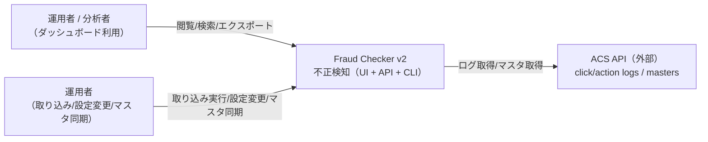

### 目的
- 外部境界（誰が/何が関わるか）を最短で共有する。
- 「本システムが何を責務として持つか」を合意する。

### 説明（一般）
- 人・外部サービス・自分たちのシステムの関係を、1枚でざっくり把握する図。
- 詳細設計より前に「誰が何に触れるか」を揃える目的で使う。

### このプロジェクトならでは
- Fraud Checker v2 は ACS API からログ/マスタを取得し、運用者はダッシュボードで閲覧する構成。
- 取り込みや設定変更は運用者（管理）側の操作として整理されている。

---

## 02. C4 コンテナ図（Container / C4-L2）

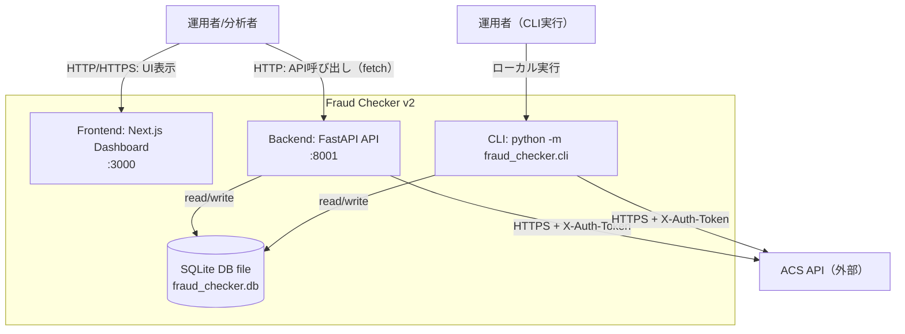

### 備考
- UI からの API 呼び出しはブラウザから `NEXT_PUBLIC_API_URL`（例: `http://localhost:8001`）へ直接行われる想定。
- CLI は FastAPI を経由せず、同じロジック（ACS クライアント + SQLiteRepository）を直接利用する。

### 説明（一般）
- システムを「動く単位（プロセス/サービス）」に分けて、通信の流れを示す図。
- どこで動いて、どこと通信するかがわかる。

### このプロジェクトならでは
- UI は Next.js、API は FastAPI、DB はローカルの SQLite ファイルという最小構成。
- CLI も同じ DB/ACS を触るため、UI と並ぶ運用経路として明示している。

---

## 03. Backend コンポーネント図（Component / C4-L3）

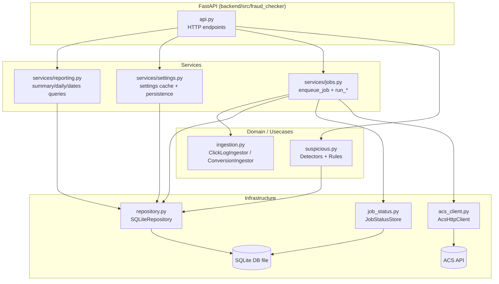

### 補足（境界/責務）
- `api.py`：HTTP 入出力、バリデーション、例外→HTTP 変換。
- `services/*`：ユースケースの組み立て（レポート、設定、ジョブ実行）。
- `ingestion.py`：ACS からの取得・ページング、DB への投入ポリシー（例外時は中断）。
- `repository.py`：SQLite スキーマ管理、CRUD/集計、マスタ参照、詳細取得。

### 説明（一般）
- バックエンド内部の「層（レイヤ）」と依存関係を示す図。
- 入口（API）→処理（Services/Domain）→保存/外部連携（Infra）の流れがわかる。

### このプロジェクトならでは
- ジョブ実行・集計・設定が `services/*` に集約され、DB アクセスは `repository.py` に一本化。
- 外部 ACS 連携は `acs_client.py` で分離されているため、交換やモック化がしやすい。

---

## 04. Frontend コンポーネント図（Component / App Router）

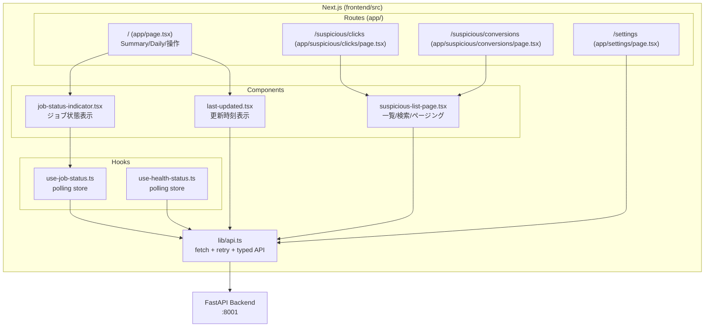

### 備考
- `use-job-status.ts` は `status=running` の間は 2 秒、そうでなければ 10 秒で `/api/job/status` をポーリング。
- `lib/api.ts` は GET 系に簡易リトライ（デフォルト 2 回）を持つ（POST 系は retries=0）。

### 説明（一般）
- 画面（Routes）と部品（Components/ Hooks）がどうつながるかを示す図。
- どのページがどのデータ取得/状態管理に依存するかがわかる。

### このプロジェクトならでは
- 不正一覧ページは `suspicious-list-page.tsx` を共通化して、クリック/成果で使い回す設計。
- ジョブ状態やヘルスはポーリングで扱うため、専用 Hook を中心に構成している。

---

## 05. 物理/デプロイ構成図 + トラフィックフロー

### 05-1. ローカル開発（AS-IS）

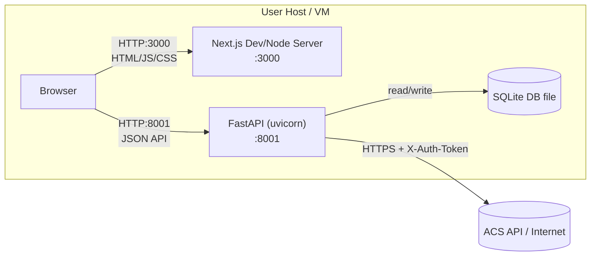

### 説明（一般）
- どのプロセスがどのポートで動くかを示す「配置図」。
- 開発環境での動作イメージを共有するために使う。

### このプロジェクトならでは
- UI（3000）と API（8001）が同一ホストで動き、DB は SQLite ファイル。
- 外部 ACS に HTTPS でアクセスするため、ローカルでも外部通信が発生する。

### 05-2. トラフィックフロー（入口→内部）

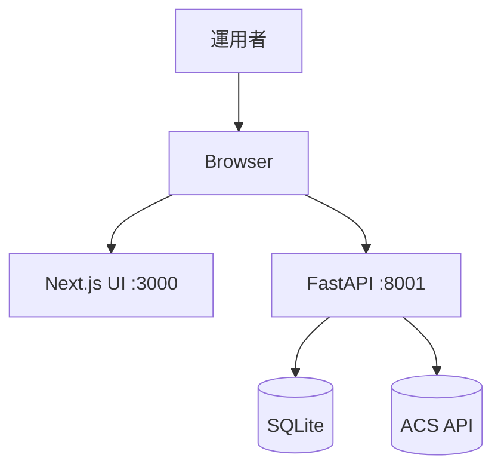

### 説明（一般）
- ユーザー操作がどの順にシステム内を流れるかを示す図。
- 入口から内部処理までの道筋をざっくり掴む。

### このプロジェクトならでは
- ブラウザが UI と API の両方に直接アクセスするため、CORS/環境変数の設定が重要。
- 外部 ACS への通信は API 側でまとめて行う。

### 前提
- ここでは「単一ホスト/単一プロセス群」を前提として図示（LB/VPC 等は未記載）。

---

## 06. ジョブ基盤/バッチ基盤の構成図 + 状態遷移

### 06-1. ジョブ実行フロー（FastAPI BackgroundTasks）

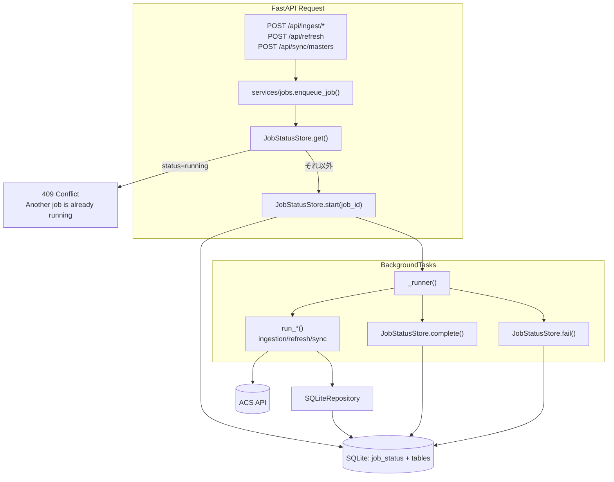

### 説明（一般）
- バッチ/ジョブの流れ（受付→実行→完了/失敗）を示す図。
- UI/API とは別に動く処理があることを明確にする。

### このプロジェクトならでは
- `JobStatusStore` で排他を行い、同時実行時は 409 を返す設計。
- 取得→変換→保存は `acs` と `repo` を経由し、SQLite に集約される。

### 06-2. JobStatus 状態遷移（State Machine）

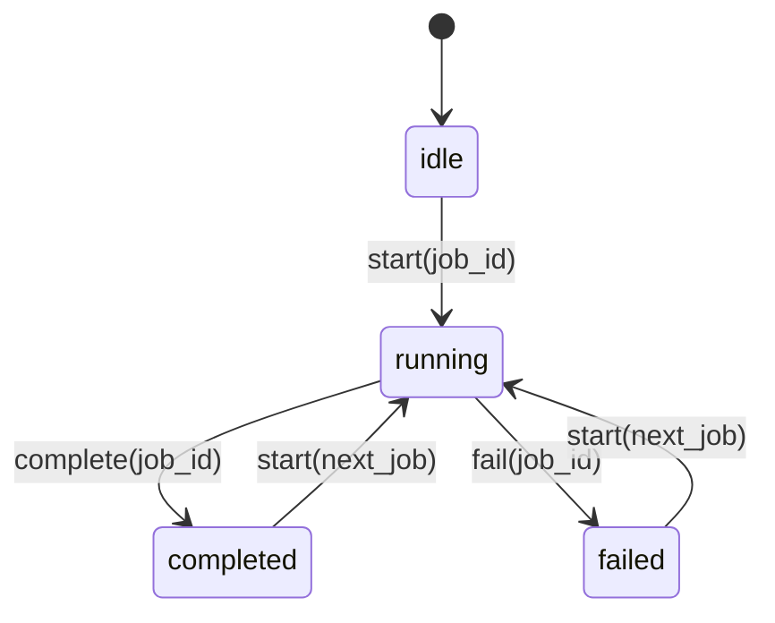

### 説明（一般）
- ジョブが取り得る状態と、その遷移ルールを示す図。
- 「今どの状態か」「どう切り替わるか」を理解しやすくする。

### このプロジェクトならでは
- `failed` になっても再実行で `running` に戻す前提の運用。
- 完了/失敗どちらも同じ経路で次のジョブに進められる。

### ポイント
- 同時実行は `job_status.status == running` で排他（409 を返す）。
- 例外はジョブ失敗として `failed` に保存し、運用者が原因解消後に再実行する前提。

---

## 07. シーケンス図（主要フロー：正常系/競合/失敗）

### 07-1. クリック取り込み（/api/ingest/clicks）

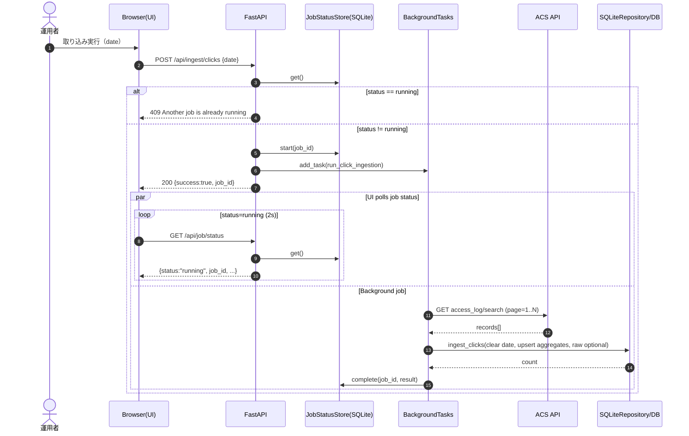

### 説明（一般）
- 1つの操作が UI→API→外部→DB と流れる様子を時系列で追う図。
- 画面操作とバックグラウンド処理の関係がわかる。

### このプロジェクトならでは
- 競合時は 409 を返し、UI はジョブ状態を 2 秒間隔でポーリング。
- クリックログは ACS からページング取得して DB へ投入する。

### 07-2. 不正クリック一覧取得（/api/suspicious/clicks）

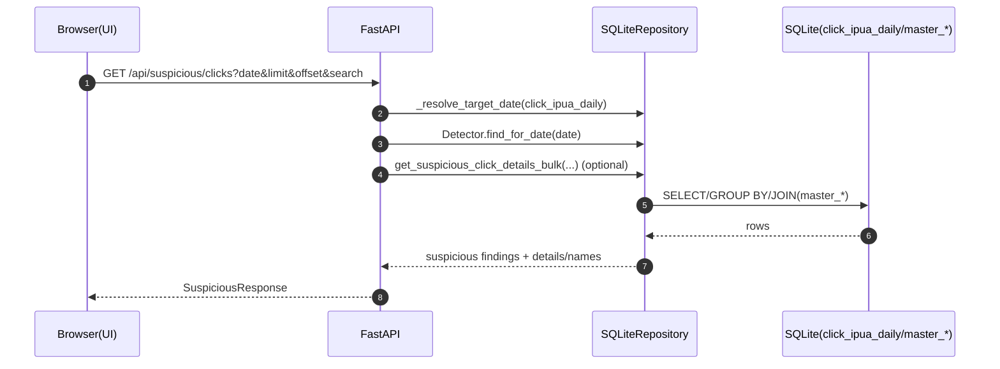

### 説明（一般）
- 読み取り系 API の処理手順を示す図。
- どの層で検索や集計が行われるかが見える。

### このプロジェクトならでは
- `click_ipua_daily` と `master_*` を JOIN して画面表示に必要な情報を補完。
- 追加詳細は optional で取得するため、レスポンス設計に柔軟性がある。

### 07-3. 設定更新（/api/settings）

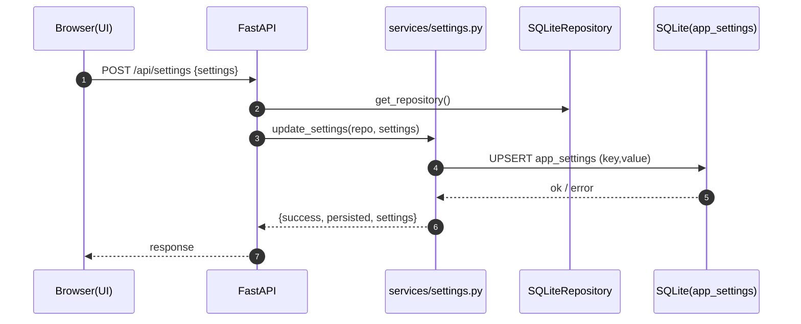

### 説明（一般）
- 設定変更がどこに保存されるかを示す CRUD フロー。
- UI→API→DB の基本パターンを理解できる。

### このプロジェクトならでは
- 設定値は `app_settings` に UPSERT で保存し、読み書きの単純化を優先。

### 07-4. マスタ同期（/api/sync/masters）

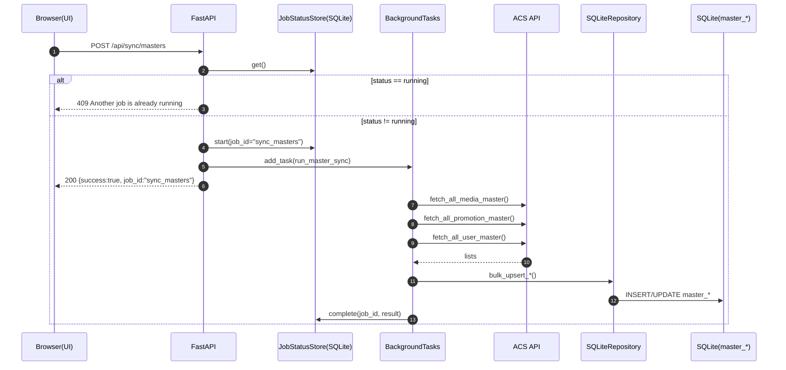

### 説明（一般）
- 外部の基礎データ（マスタ）を取り込む手順を示す図。
- データ量が多い想定でも流れを追える。

### このプロジェクトならでは
- メディア/プロモーション/ユーザーの 3 種マスタを ACS から取得。
- `bulk_upsert_*` により差分更新でDBを保つ。

---

## 08. データモデル（ER）+ データフロー

### 08-1. ER 図（概念/論理）

> 実DBは SQLite で、FK 制約は明示していないが「論理的な関係」を図示しています。

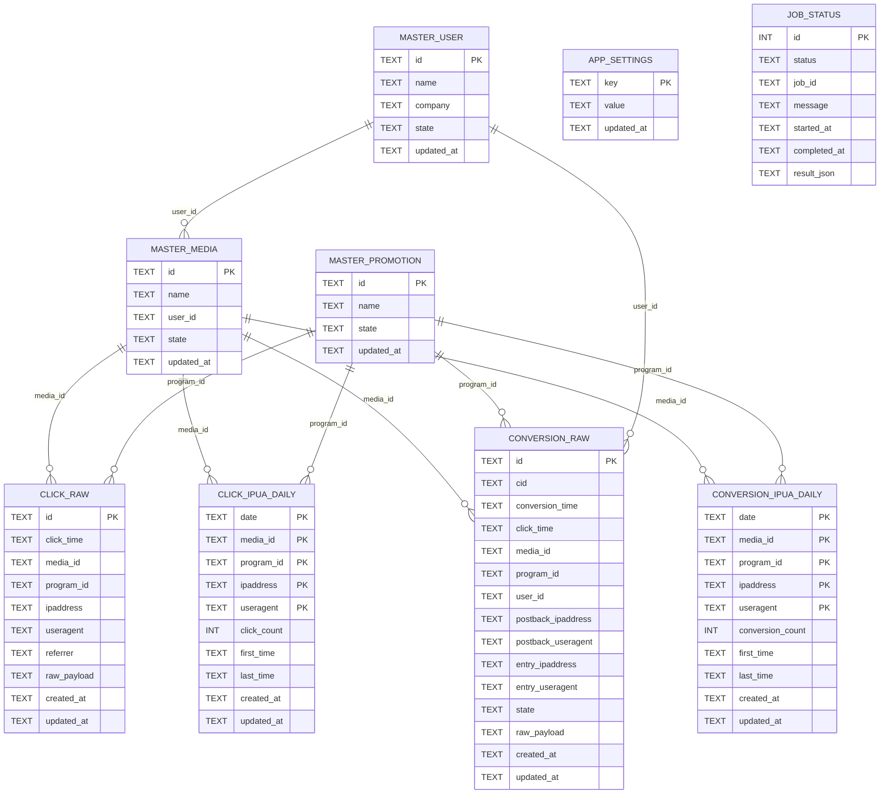

### 説明（一般）
- テーブルとその関係（結びつき）を示す図。
- どのデータがどの軸で紐づくかがわかる。

### このプロジェクトならでは
- RAW と 日次集計（IP/UA 単位）が分離されており、分析と保存を両立。
- `master_*` を参照することで画面表示の名称解決を行う。

### 08-2. データフロー図（DFD：どこからどこへ）

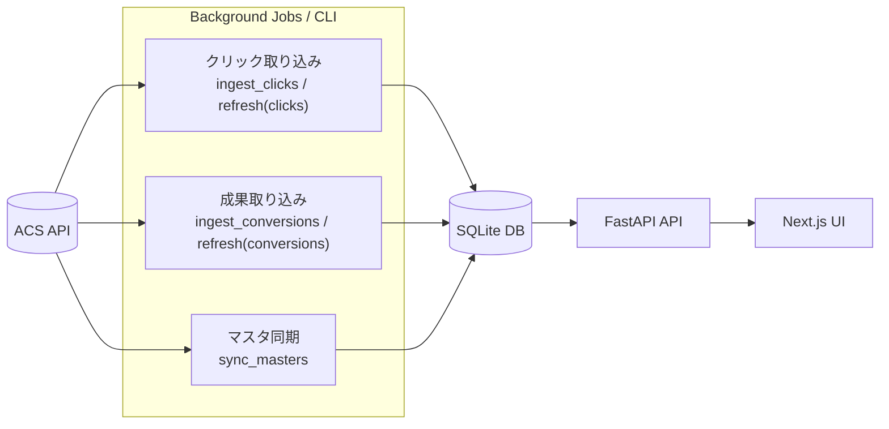

### 説明（一般）
- データがシステム内をどの経路で移動するかを示す図。
- 読み取り/書き込みの起点が理解しやすい。

### このプロジェクトならでは
- 外部 ACS からの取得はジョブ/CLI が担い、UI は API 経由で参照する。

---

## 09. API・インタフェース俯瞰（一覧/エラー）

### 09-1. API 俯瞰（グルーピング）

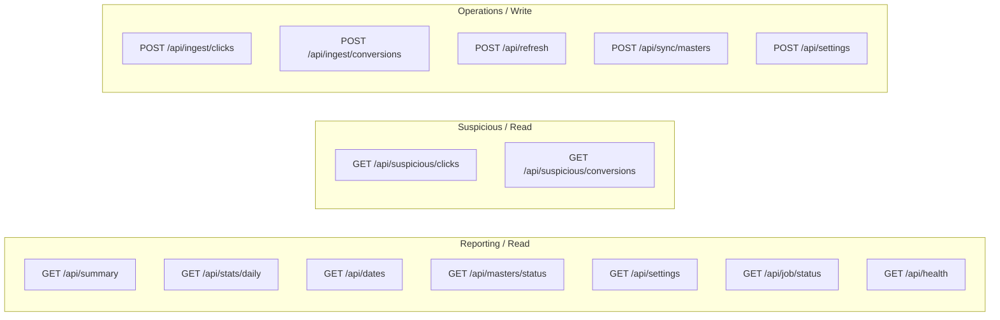

### 説明（一般）
- API を「読み取り」と「書き込み」に分類して俯瞰する図。
- 使い手がどの操作でどのAPIを叩くかを整理できる。

### このプロジェクトならでは
- `ingest/refresh/sync` はジョブ起動系、`summary/suspicious` は閲覧系に分けて設計。

### 09-2. API 一覧表（抜粋）

| Method | Path | 用途 | 主な副作用 |
|---|---|---|---|
| GET | `/api/health` | 稼働・設定ヘルス | なし |
| GET | `/api/summary` | サマリ | なし |
| GET | `/api/stats/daily` | 日次統計 | なし |
| GET | `/api/dates` | 利用可能日付 | なし |
| GET | `/api/suspicious/clicks` | 不正クリック一覧 | なし |
| GET | `/api/suspicious/conversions` | 不正成果一覧 | なし |
| POST | `/api/ingest/clicks` | クリック取り込み（指定日） | DB 更新 + ジョブ起動 |
| POST | `/api/ingest/conversions` | 成果取り込み（指定日） | DB 更新 + ジョブ起動 |
| POST | `/api/refresh` | 直近N時間の差分取り込み | DB 更新 + ジョブ起動 |
| POST | `/api/sync/masters` | マスタ同期 | DB 更新 + ジョブ起動 |
| GET | `/api/job/status` | ジョブ状態 | なし |
| GET/POST | `/api/settings` | 検知閾値の参照/更新 | app_settings 更新 |
| GET | `/api/masters/status` | マスタ件数など | なし |

### 09-3. ステータスコード/エラー（AS-IS）

| HTTP | 代表ケース | 例 |
|---|---|---|
| 200 | 正常 | `SuspiciousResponse` / `JobStatusResponse` |
| 400 | 入力不正 | `Invalid date format. Use YYYY-MM-DD` |
| 409 | ジョブ競合 | `Another job is already running` |
| 500 | 例外 | 依存先（ACS/DB）や実装例外 |

### 09-4. 認証/認可（AS-IS）
- 本 API 自体の認証は実装されていない前提（ローカル利用/内部利用を想定）。
- 外部 ACS への認証は `X-Auth-Token={accessKey}:{secretKey}`（環境変数）で実施。

---

## 10. フロントエンド（サイトマップ/画面状態）

### 10-1. サイトマップ（Routes）

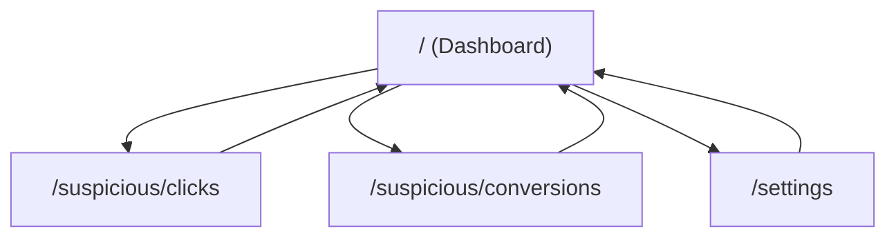

### 説明（一般）
- 画面同士の遷移関係をざっくり示す図。
- どこからどこへ移れるかを理解するための地図。

### このプロジェクトならでは
- ダッシュボードが入口で、不正一覧と設定に枝分かれする構造。

### 10-2. UI 状態遷移（不正一覧ページの典型）

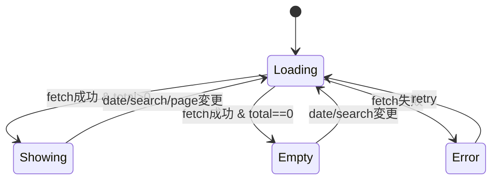

### 説明（一般）
- 画面が「読み込み」「空」「エラー」などに切り替わる流れを示す図。
- ユーザー体験の分岐が明確になる。

### このプロジェクトならでは
- 不正一覧は日付/検索/ページ変更で再取得するため、戻り先は常に Loading。

### 10-3. UI ↔ API データ取得フロー（概略）

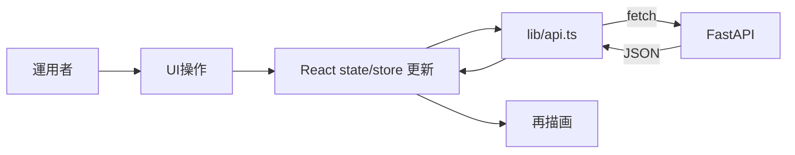

### 説明（一般）
- UI が API からデータを取得し、画面を再描画する流れを示す図。
- React の基本的なデータフローを理解するための図。

### このプロジェクトならでは
- 取得は `lib/api.ts` に集約され、UI 側は state 更新に専念する設計。

---

## 11. セキュリティ（DFD + Trust Boundary / 最小）

### 11-1. DFD（Trust Boundary 付き）

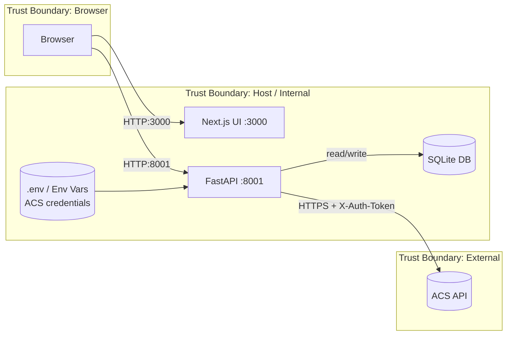

### 説明（一般）
- どこが「信頼できる境界」かを示し、外部と内部の境目を明確にする図。
- どのデータがどこを通るかがわかる。

### このプロジェクトならでは
- ACS 認証情報は `.env` に置き、API のみが外部と通信する前提。
- UI と API は同一ホスト想定のため境界はシンプル。

### 11-2. 保護すべきデータ（抜粋）
- 秘密情報：`ACS_ACCESS_KEY` / `ACS_SECRET_KEY` / `ACS_TOKEN`
- 個人情報・準個人情報：IP address / User-Agent（ログ由来）
- DB ファイル（改ざん/持ち出し耐性、アクセス権）

### 11-3. 最小のリスク洗い出し（STRIDEの一部）

| 脅威 | 例 | 最小対策（要検討） |
|---|---|---|
| Spoofing | API を第三者が叩く | 内部ネットワーク限定/Basic認証/Reverse proxy で保護 |
| Tampering | SQLite を直接改ざん | ファイル権限・配置、バックアップ監査 |
| Info Disclosure | IP/UA が漏れる | UI/ログのマスキング、アクセス制御 |
| DoS | ingest/refresh の連打 | 認証 + レート制限、ジョブキュー化 |

---

## 12. 運用（最小：バックアップ/日次運用）

### 12-1. バックアップ/リストア（SQLite）

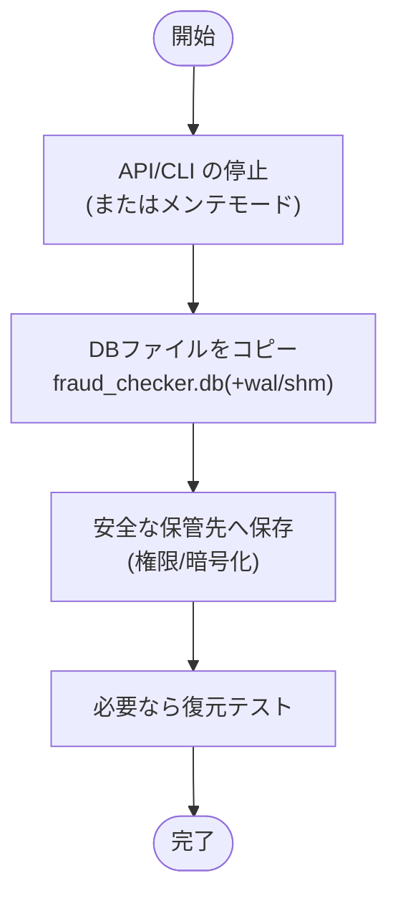

### 説明（一般）
- SQLite のバックアップ手順を順番で示す図。
- 「停止→コピー→保管→確認」という基本を押さえるためのもの。

### このプロジェクトならでは
- `fraud_checker.db` に加えて `wal/shm` を含めてコピーする点が重要。

### 12-2. 日次運用（例：前日分の取り込み→確認）

```mermaid
flowchart LR
  schedule[運用者/スケジュール] --> ingest[取り込み実行<br/>POST /api/ingest/* or CLI]
  ingest --> status[ジョブ状態確認<br/>GET /api/job/status]
  status -->|completed| review[不正一覧レビュー<br/>/suspicious/*]
  status -->|failed| fix[原因調査/復旧<br/>ヘルス/ログ/設定]
  fix --> ingest
```

### 説明（一般）
- 日々の運用がどの順で回るかを示す図。
- 失敗時にどこへ戻るかがわかる。

### このプロジェクトならでは
- ジョブ完了後に `/suspicious/*` で確認する運用が中心。
- 失敗時はヘルス/ログ/設定を見直して再実行する想定。

### 備考
- 現状はインプロセスの `BackgroundTasks` 実行のため、プロセス停止=ジョブ停止になる点に注意。
